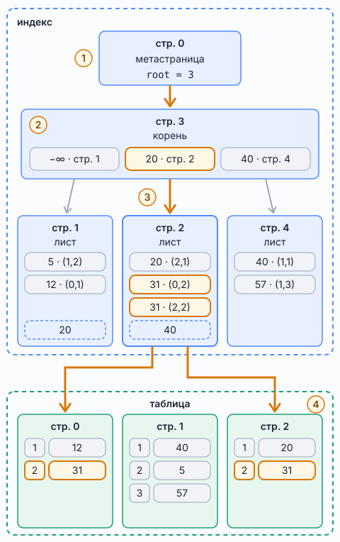

# B-дерево в индексе PostgreSQL

*B-tree index; в PostgreSQL — тип индекса по умолчанию: `CREATE INDEX` без `USING` создаёт именно его*

Справочник о том, как B-tree-индекс PostgreSQL лежит на диске и как по нему идёт поиск по равенству. Термины взяты из документации PostgreSQL (глава «B-Tree Indexes») и из описания реализации `src/backend/access/nbtree/README`. Утверждения про устройство страниц проверены на PostgreSQL 16.15 с расширением `pageinspect`, вывод приведён в разделе «Как это выглядит в настоящем индексе».

## Индекс и таблица — разные файлы

B-tree-индекс и таблица хранятся в разных файлах. Листья дерева — это страницы индекса, а не таблицы.

- Таблица (heap, куча) деревом не является: строки лежат в её страницах без определённого порядка.
- B-tree-индекс — отдельное дерево из страниц: корень, внутренние страницы и листья. Поиск идёт от корня вниз, к листу.
- В листе хранится запись индекса: значение ключа и TID (в таблице — системная колонка `ctid`), то есть адрес строки в таблице: номер страницы и номер записи в ней. Самой строки таблицы в листе нет.
- Найдя в листе подходящий ключ, PostgreSQL по TID читает страницу таблицы и берёт строку оттуда. Это Index Scan: сначала дерево индекса, потом таблица.
- Исключение — Index Only Scan. Если все нужные запросу колонки есть в индексе (например, добавлены через `INCLUDE`), а страница таблицы отмечена в карте видимости (visibility map) как полностью видимая, читать таблицу не нужно. Листья и тогда остаются листьями индекса: всё нужное уже лежит в них.

В MySQL InnoDB устроено иначе. У первичного ключа там кластерный индекс: его листья и есть строки таблицы, таблица хранится внутри дерева первичного ключа. Листья вторичных индексов хранят значение первичного ключа, а не адрес строки. В PostgreSQL кластерных индексов в этом смысле нет. Команда `CLUSTER` один раз физически переупорядочивает строки таблицы, после чего таблица по-прежнему остаётся кучей и при вставках порядок не поддерживает.

## Страница

Страница (page, она же блок) — кусок файла фиксированного размера, по умолчанию 8 КБ. Размер задаётся при сборке PostgreSQL (константа `BLCKSZ`), посмотреть его можно командой `SHOW block_size`, она возвращает `8192`. Страница — минимальная единица, которой PostgreSQL читает и пишет данные. Даже ради одной строки он читает с диска всю страницу и кладёт её в кэш `shared_buffers` тоже целиком.

Файлы и таблицы, и индекса нарезаны на такие страницы, их номера идут с нуля. Поэтому адрес строки (TID) — пара «номер страницы, номер записи в странице», например `(42, 7)`.

Из чего состоит страница:

- **Заголовок** (24 байта): служебные сведения, в том числе где начинается и где кончается свободное место.
- **Массив указателей на записи** (line pointers): идёт от начала страницы, по 4 байта на запись. Номер записи в TID — это номер такого указателя.
- **Свободное место** посередине.
- **Сами записи**: заполняют страницу с конца, навстречу указателям.
- **Special space** в самом конце страницы. У таблицы его нет. У B-tree там лежат номера левой и правой соседних страниц того же уровня, уровень страницы в дереве и признаки, кто она: корень, внутренняя страница или лист.

В B-tree одна страница — один узел дерева. Спуститься по дереву значит прочитать несколько страниц: корень, затем по одной странице на каждом уровне, затем лист. В страницу 8 КБ помещаются сотни записей, поэтому даже у большой таблицы дерево невысокое: в индексе по таблице из трёх миллионов строк из раздела ниже три уровня.

## Где индекс лежит на диске

Индекс — отдельный файл (или несколько) в каталоге данных кластера, рядом с файлами таблиц:

```
$PGDATA/base/<oid базы>/<relfilenode>
```

- `<oid базы>` — числовой идентификатор базы данных, `<relfilenode>` — числовое имя файла индекса (не имя индекса).
- Когда файл дорастает до 1 ГБ, следующие сегменты получают суффиксы `.1`, `.2` и так далее.
- У индекса бывает ещё файл `_fsm` (карта свободного места). У таблицы, кроме неё, есть `_vm` — карта видимости, которая нужна для Index Only Scan.
- Если индекс создан в другом табличном пространстве, файл лежит в каталоге этого пространства, ссылка на который есть в `$PGDATA/pg_tblspc`.

Путь к файлу относительно `$PGDATA` показывает функция `pg_relation_filepath`:

```sql
SELECT pg_relation_filepath('account_operation_account_id_idx') AS index_file,
       pg_relation_filepath('account_operation') AS table_file;
```

```
  index_file  |  table_file
--------------+--------------
 base/5/16438 | base/5/16430
```

Размер индекса в страницах хранит колонка `relpages` в `pg_class` (это оценка, её обновляют `VACUUM` и `ANALYZE`), точный размер в байтах возвращает `pg_relation_size`. Сами файлы — обычные файлы операционной системы, PostgreSQL читает их через файловую систему.

## B-дерево и файл индекса — одно и то же

Отдельной структуры, которая «смотрит» на индекс, нет. B-дерево — это и есть файл индекса на диске, а точнее, способ, которым его страницы ссылаются друг на друга.

- Файл индекса — последовательность страниц по 8 КБ: 0, 1, 2, 3…
- Каждая страница — один узел дерева. Страница 0 — служебная метастраница (metapage), в ней записан номер корня. Одна из страниц — корень, остальные — внутренние страницы или листья.
- Рёбра дерева — номера страниц, записанные внутри узлов. Запись корня «20 · стр. 2» на рис. 1 и есть ребро к дочернему узлу. Другого хранилища для рёбер нет.

В дереве из Java-объектов, как `TreeNode` из [`BinaryTree.md`](BinaryTree.md), узел — объект в куче, а ссылка на потомка — адрес объекта в памяти. В индексе узел — страница файла, а ссылка на потомка — номер страницы. По номеру страницы `N` сразу вычисляется, где она лежит в файле:

`смещение = N × 8192`

PostgreSQL не загружает дерево в память целиком и не строит его заново. Каждый шаг поиска — чтение одной страницы. Сначала PostgreSQL ищет её в `shared_buffers`: если страница уже там, диск не нужен, если нет — читает её с диска в кэш. Копия в кэше устроена байт в байт как страница на диске, поэтому и в памяти дерево — всё те же страницы с номерами внутри.

## Что лежит в записях индекса

Индекс хранит копию каждого значения ключевой колонки. Искомое значение сравнивается с этими копиями, а номера страниц только показывают, куда идти дальше.

- **Запись внутренней страницы и корня**: значение-разделитель и номер дочерней страницы индекса. Запись «20 · стр. 2» значит: ключи от 20 до следующего разделителя ищи на странице 2. Одна запись внутренней страницы хранится без значения: первая после верхней границы страницы, а если границы нет — самая первая. Она означает «минус бесконечность» и ведёт к ключам, которые меньше следующего разделителя.
- **Запись листа**: значение ключа и TID — адрес строки в таблице. Запись «31 · (0,2)» значит: строка с `account_id = 31` лежит в таблице на странице 0, в записи 2.
- **Верхняя граница страницы** (high key, термин из `nbtree/README`): у каждой страницы, кроме самой правой на своём уровне, первая запись хранит границу, выше которой ключей на этой странице нет. По ней поиск понимает, нужно ли идти на соседнюю страницу справа.
- **Дедупликация** (deduplication, с PostgreSQL 13 включена по умолчанию): одинаковые ключи в листе склеиваются в одну запись, в которой хранится не один TID, а их список (posting list). Это экономит место, когда у одного значения много строк.

Номер страницы во внутренней записи указывает на страницу индекса, на шаг вниз по дереву. TID в листе указывает на страницу таблицы.

Сравнение выполняет функция сравнения из класса операторов (operator class) индекса. Для `integer` это сравнение чисел (`btint4cmp`). Для `text` сравнение учитывает правила сортировки (collation), поэтому индекс, построенный с одной collation, не годится для запроса, который сравнивает строки по другой.

## Поиск account_id = 31

```sql
SELECT *
FROM account_operation
WHERE account_id = 31;
```



*Рис. 1. Поиск `account_id = 31`. Синие страницы — файл индекса, зелёные — файл таблицы. Жёлтым выделен путь запроса и найденные записи, серые стрелки — ветки, в которые поиск не пошёл. Цифры в кружках — номера шагов из таблицы ниже*

Как читать рисунок:

- Нумерация «стр. N» у каждого файла своя: страница 0 индекса и страница 0 таблицы — разные страницы.
- Запись корня — разделитель и номер дочерней страницы индекса: `20 · стр. 2`.
- Запись листа — ключ и TID: `31 · (0,2)` значит «страница 0 таблицы, запись 2».
- Пунктирная ячейка внизу листа — верхняя граница страницы. На самой странице это первая запись, на рисунке она стоит внизу, рядом с ключами, которые ограничивает. У страницы 4 границы нет: это самый правый лист.
- В странице таблицы слева номер записи, справа значение `account_id` в этой строке.
- В листе стр. 2 две записи с ключом `31`. В настоящем индексе PostgreSQL 13 и новее такие записи обычно склеены в одну со списком TID, см. раздел «Как это выглядит в настоящем индексе».

**Искомое значение** — `31`, оно одно на весь поиск. **Текущий ключ** — ключ на прочитанной странице, с которым в этот момент сравнивается `31`. На каждой странице текущие ключи свои: в корне это разделители `20` и `40`, в листе — ключи записей `20`, `31`, `31` и верхняя граница `40`.

| Шаг | Прочитанная страница | Текущие ключи на странице | Сравнение с искомым `31` | Что дальше |
|---|---|---|---|---|
| 1 | стр. 0 индекса, метастраница | — | — | номер корня — стр. 3 |
| 2 | стр. 3 индекса, корень | `−∞`, `20`, `40` | `31 ≥ 20` и `31 < 40` | ветка `20`, стр. 2 |
| 3 | стр. 2 индекса, лист | `20`, `31`, `31`, верхняя граница `40` | `20 < 31`, дальше `31 = 31` у двух записей; `40 > 31` | взять TID `(0,2)` и `(2,2)`; стр. 4 не читать |
| 4 | стр. 0 и стр. 2 таблицы | — | — | проверить видимость строк и отдать их в результат |

Подробнее о шагах:

1. Номер корня записан в метастранице. При выполнении запроса PostgreSQL её обычно не перечитывает: содержимое метастраницы он держит в памяти, в кэше описаний таблиц и индексов (relcache). Это видно по счётчику страниц в разделе ниже.
2. Внутри страницы ключи отсортированы, и нужную ветку PostgreSQL находит двоичным поиском, а не перебором слева направо: в настоящей странице сотни ключей. На рисунке ключей три, и порядок сравнений не важен.
3. В листе двоичным поиском находится первая запись с ключом не меньше `31`, затем поиск идёт вправо, пока ключ равен `31`. Верхняя граница стр. 2 равна `40`, а `40 > 31`, поэтому строк с ключом `31` на страницах правее быть не может.
4. По каждому TID читается страница таблицы. Для каждой строки проверяется видимость (MVCC): по полям `xmin` и `xmax` строки PostgreSQL решает, видна ли эта версия строки текущей транзакции. В записях индекса сведений о видимости нет, поэтому в таблицу приходится идти даже за строкой, которую индекс уже нашёл.

Итого по рисунку прочитаны две страницы индекса (корень и лист) и две страницы таблицы. Метастраница добавляется третьей страницей индекса, только если её содержимого ещё нет в памяти. Страницы 1 и 4 индекса и страница 1 таблицы поиск не трогал.

## Как это выглядит в настоящем индексе

Проверено на PostgreSQL 16.15. Таблица из трёх миллионов строк со случайным `account_id` от 0 до 1 000 000, плюс две строки с `account_id = 31`, добавленные отдельно:

```sql
CREATE TABLE account_operation (
    id bigserial PRIMARY KEY,
    account_id int NOT NULL,
    amount numeric NOT NULL
);

CREATE INDEX account_operation_account_id_idx
ON account_operation (account_id);
```

Индекс занял 5329 страниц, таблица — 19109. Метастраница, прочитанная функцией `bt_metap` из расширения `pageinspect`:

```sql
SELECT root, level
FROM bt_metap('account_operation_account_id_idx');
```

```
 root | level
------+-------
  290 |     2
```

Корень лежит на странице 290, его уровень 2, значит в дереве три уровня: корень, внутренние страницы, листья. Путь поиска `31`, прочитанный функциями `bt_page_stats` и `bt_page_items`:

| Уровень | Страница индекса | Записей на странице | Верхняя граница страницы | Куда ведёт поиск `31` |
|---|---|---|---|---|
| корень | 290 | 19 | нет, страница самая правая | первая запись `−∞` ведёт на стр. 3, потому что следующий разделитель `53599 > 31` |
| внутренняя | 3 | 285 | `53599` | первая запись `−∞` ведёт на стр. 1, следующий разделитель `187 > 31` |
| лист | 1 | 183 | `187` | запись с ключом `31` |

Листьев в индексе 5308, в среднем по 180 записей на лист. Вся информация о трёх миллионах строк уместилась в три уровня.

Запись листа с ключом `31` — одна, со списком из семи TID (дедупликация):

```sql
SELECT itemoffset, htid, tids
FROM bt_page_items('account_operation_account_id_idx', 1)
WHERE itemoffset = 33;
```

```
 itemoffset |   htid    |                                           tids
------------+-----------+-------------------------------------------------------------------------------------------
         33 | (275,124) | {"(275,124)","(726,153)","(5222,69)","(9875,145)","(15021,48)","(19108,45)","(19108,46)"}
```

Сколько страниц прочитал запрос:

```sql
EXPLAIN (ANALYZE, BUFFERS, COSTS OFF, TIMING OFF)
SELECT *
FROM account_operation
WHERE account_id = 31;
```

```
 Index Scan using account_operation_account_id_idx on account_operation (actual rows=7 loops=1)
   Index Cond: (account_id = 31)
   Buffers: shared hit=9
```

Девять страниц: три страницы индекса (корень 290, внутренняя 3, лист 1) и шесть страниц таблицы — 275, 726, 5222, 9875, 15021 и 19108; две последние строки лежат на одной странице 19108. Метастраницы в счётчике нет: номер корня взят из памяти.

## Что из этого следует

- Индекс занимает место: в нём копия каждого значения ключевых колонок и TID на каждую строку. В примере выше индекс по одной колонке `int` — 5329 страниц против 19109 у таблицы.
- Любой `INSERT`, а также `UPDATE` ключевой колонки, записывает новую запись и в индекс. Поэтому каждый лишний индекс замедляет запись.
- Если строк с одним значением много и они разбросаны по разным страницам таблицы, каждый TID может стоить отдельного чтения страницы. Тогда планировщик выбирает Bitmap Index Scan: собирает все TID, сортирует их по номеру страницы и читает каждую страницу таблицы один раз.
- Число чтений страниц индекса при поиске по равенству равно высоте дерева, а высота растёт очень медленно: при сотнях записей на странице каждый новый уровень увеличивает вместимость в сотни раз.

## Типичные вопросы на собеседовании

**Листья B-tree-индекса в PostgreSQL — это строки таблицы?**
Нет. Листья — страницы файла индекса. В них ключ и TID, адрес строки в таблице. Сама таблица — куча без порядка, в отдельном файле.

**Что хранится во внутренних страницах, а что в листьях?**
Во внутренних — разделители и номера дочерних страниц индекса. В листьях — ключи и TID строк таблицы.

**Как PostgreSQL находит корень?**
Номер корня записан в метастранице, странице 0 файла индекса. Содержимое метастраницы PostgreSQL держит в памяти и при каждом запросе её не перечитывает.

**Зачем идти в таблицу, если индекс уже нашёл ключ?**
За остальными колонками строки и за проверкой видимости: в индексе нет сведений, видна ли версия строки текущей транзакции. Без похода в таблицу обходится только Index Only Scan, и только по страницам, отмеченным в карте видимости.

**Почему дерево такое невысокое?**
Узел — страница 8 КБ, в ней сотни записей. В индексе по таблице из трёх миллионов строк — три уровня, в листе около 180 записей.

**Чем индекс PostgreSQL отличается от кластерного индекса InnoDB?**
В InnoDB листья первичного ключа и есть строки таблицы, а вторичные индексы хранят значение первичного ключа. В PostgreSQL все индексы хранят TID, а таблица лежит отдельно кучей.

**Что такое дедупликация в B-tree PostgreSQL?**
С версии 13 одинаковые ключи в листе хранятся одной записью со списком TID. Индекс по колонке с повторяющимися значениями становится меньше.

**Почему лишний индекс вредит?**
Он занимает место и замедляет запись: каждая вставка и каждое изменение ключевой колонки обновляет и индекс.

## См. также

- [`BinarySearchTree.md`](BinarySearchTree.md) — двоичное дерево поиска: правило порядка и поиск за высоту дерева
- [`BinaryTree.md`](BinaryTree.md) — термины: корень, лист, высота
- [`Pattern_BinarySearch.md`](../problems/block05_binary_search/Pattern_BinarySearch.md) — бинарный поиск; внутри страницы индекса нужную запись ищут именно им
- Документация PostgreSQL, глава «B-Tree Indexes»: https://www.postgresql.org/docs/current/btree.html
