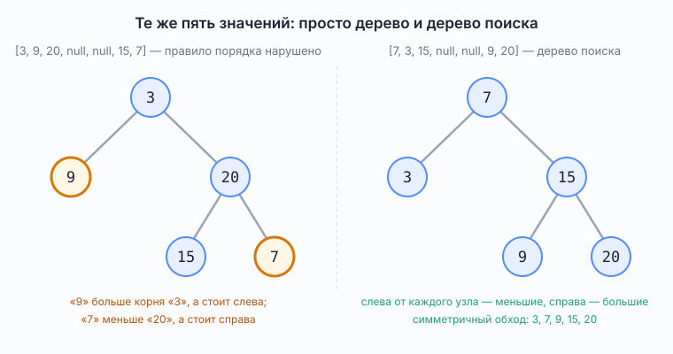
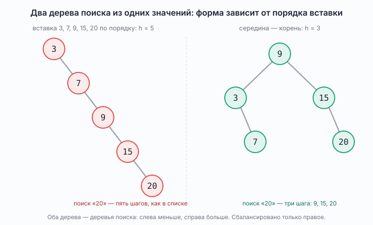

# Двоичное дерево поиска

*Binary search tree, BST; в стандартной библиотеке — `TreeMap` и `TreeSet`*

Справочник о том, чем дерево поиска отличается от просто двоичного дерева из [`BinaryTree.md`](BinaryTree.md), и почему «дерево поиска» и «сбалансированное дерево» — два разных свойства. Все утверждения о поведении проверены запуском `src/demo/BinarySearchTreeDemo.java` на JDK 25 (JetBrains Runtime), 13 проверок.

## Что это

Двоичное дерево поиска — двоичное дерево с правилом порядка: у каждого узла все значения в левом поддереве меньше его значения, все значения в правом поддереве больше. Правило действует на всё поддерево целиком, а не только на двух прямых потомков.

Деревья из разборов блока 6 этому правилу не подчиняются: в `[3, 9, 20, null, null, 15, 7]` значения расставлены произвольно. Задачи `maxDepth`, `isSymmetric`, `levelOrder` на порядок значений и не смотрят — им важна только форма.



*Рис. 1. Те же пять значений. Слева дерево из примеров блока: `9` больше корня `3`, но стоит слева, — правило нарушено. Справа та же форма, значения переставлены так, что слева от каждого узла меньшие, справа большие: `[7, 3, 15, null, null, 9, 20]`*

Как переставить значения под заданную форму: симметричный обход (левое поддерево, узел, правое поддерево) должен выдать их по возрастанию. Форма задаёт порядок обхода узлов, остаётся вписать в этот порядок отсортированные значения.

## Что даёт правило порядка

Поиск — спуск от корня по одной ветке: значение меньше текущего — налево, больше — направо, равно — нашли, `null` — значения в дереве нет. На каждом шаге отбрасывается целое поддерево, как в бинарном поиске из блока 5 отбрасывается половина массива. Разница только в том, что там середина вычисляется по индексам, а здесь она уже стоит в узле, и переход идёт по ссылке. Число шагов не больше высоты: на рис. 1 поиск `9` — три шага, `7`, `15`, `9`; поиск `8` — те же три шага и тупик.

Симметричный обход (in-order) выдаёт значения по возрастанию. Отсюда строка в таблице обходов [`BinaryTree.md`](BinaryTree.md): симметричный порядок нужен «почти только для дерева поиска» — задачи «k-й наименьший элемент», «проверить, что это дерево поиска».

Вставка идёт тем же спуском, что и поиск, до `null`, и туда ставится новый узел. Дубликаты в простом варианте не вставляются: `TreeSet` тоже хранит каждое значение один раз.

```java
static TreeNode insert(TreeNode root, int value) {
    if (root == null) {
        return new TreeNode(value);
    }
    if (value < root.val) {
        root.left = insert(root.left, value);
    } else if (value > root.val) {
        root.right = insert(root.right, value);
    }
    return root;
}
```

## Дерево поиска не обязано быть сбалансированным

Это два независимых свойства. Дерево поиска — про порядок значений. Сбалансированность — про форму: у каждого узла высоты левого и правого поддеревьев различаются не больше чем на единицу, и тогда `h ≈ log₂ n`.

Одно из другого не следует. Вставь в пустое дерево `3, 7, 9, 15, 20` по порядку: каждое следующее больше всех предыдущих и уходит вправо. Получится цепочка: правило порядка выполнено, симметричный обход по-прежнему даёт возрастание, но `h = n = 5`, и поиск `20` идёт за пять шагов — не лучше списка.



*Рис. 2. Одни и те же значения, два дерева поиска. Слева — результат вставки по возрастанию, `h = 5`. Справа — сборка «середина — корень», `h = 3`. Оба соблюдают правило порядка, сбалансировано только правое*

На `10⁴` узлах разница уже в сотни раз: цепочка ищет последний элемент за `10⁴` шагов, сбалансированное дерево — за `14`, потому что `h = ⌈log₂(10⁴ + 1)⌉ = 14`.

Чтобы дерево поиска оставалось сбалансированным при любых вставках и удалениях, его надо перестраивать после каждой операции. Так делают самобалансирующиеся деревья: красно-чёрное, АВЛ. `TreeMap` и `TreeSet` в стандартной библиотеке — красно-чёрное дерево, поэтому у них `get`, `put`, `containsKey` гарантированно `O(log n)` при любом порядке вставки. В библиотеке других деревьев поиска нет, и от этого кажется, что дерево поиска сбалансировано всегда. На собеседовании «дерево поиска» без уточнения — только правило порядка, и вопрос «что будет на отсортированном входе» ловит именно это.

## Как построить сбалансированное дерево из отсортированного массива

Середина массива становится корнем: слева от неё всё меньше, справа всё больше, значит правило порядка выполнено само собой. С каждой половиной поступают так же. Это тот же бинарный поиск, только вместо «сравнить с серединой» — «сделать середину корнем».

```java
static TreeNode fromSortedArray(int[] sortedValues, int lowIndex, int highIndex) {
    if (lowIndex > highIndex) {
        return null;
    }
    int middleIndex = lowIndex + (highIndex - lowIndex) / 2;
    TreeNode root = new TreeNode(sortedValues[middleIndex]);
    root.left = fromSortedArray(sortedValues, lowIndex, middleIndex - 1);
    root.right = fromSortedArray(sortedValues, middleIndex + 1, highIndex);
    return root;
}
```

Для `3, 7, 9, 15, 20`: середина `9` — корень; левая половина `3, 7` даёт `3` с правым потомком `7`; правая `15, 20` даёт `15` с правым потомком `20`. Запись `[9, 3, 15, null, 7, null, 20]`, `h = 3` — меньше при пяти узлах не бывает. Половины делятся пополам, поэтому высота получается `⌈log₂(n + 1)⌉`: для `10⁴` узлов это `14`.

Формула середины `lowIndex + (highIndex - lowIndex) / 2` — та же, что в блоке 5; о ней в [`index-arithmetic.md`](../index-arithmetic.md).

## Где это в проекте и в книге

- `src/demo/BinarySearchTreeDemo.java` — вставка, поиск со счётом шагов, симметричный обход, цепочка против сборки серединой, предел `10⁴`.
- [`BinaryTree.md`](BinaryTree.md) — форма, обходы, глубина и высота; здесь только то, что добавляет правило порядка.
- Макдауэлл, глава 4: задача 4.2 «Минимальное дерево» — сборка из отсортированного массива, ровно `fromSortedArray`; 4.4 «Проверка сбалансированности» — та же высота, что в `maxDepth`, посчитанная для обоих поддеревьев; 4.5 «Проверка BST» — проверить правило порядка. Задач по дереву поиска в плане блока 6 нет; если брать с LeetCode, то 700 (поиск), 98 (проверка правила), 108 (из отсортированного массива), 230 (k-й наименьший).

## Типичные вопросы на собеседовании

**Чем дерево поиска отличается от двоичного дерева?**
Правилом порядка: слева от узла меньшие значения, справа большие, для всего поддерева. Форма та же.

**За сколько ищется значение?**
За высоту: `O(h)`. У сбалансированного дерева `h ≈ log₂ n`, у цепочки `h = n`.

**Всегда ли дерево поиска сбалансировано?**
Нет. Вставка отсортированных значений даёт цепочку, которая остаётся деревом поиска. Сбалансированность держат самобалансирующиеся деревья — красно-чёрное в `TreeMap`/`TreeSet`, АВЛ.

**Каким из трёх обходов в глубину надо пройти дерево поиска, чтобы значения выписались по возрастанию?**
Симметричным. Три обхода дают три разных списка; на дереве `[7, 3, 15, null, null, 9, 20]` с рис. 1:

| Обход | Порядок «узел — поддеревья» | Вывод | Отсортирован? |
|---|---|---|---|
| прямой (pre-order) | узел, левое, правое | `7, 3, 15, 9, 20` | нет |
| симметричный (in-order) | левое, узел, правое | `3, 7, 9, 15, 20` | да |
| обратный (post-order) | левое, правое, узел | `3, 9, 20, 15, 7` | нет |

Симметричный обход сначала выписывает всё левое поддерево — по правилу порядка это все меньшие значения, — потом сам узел, потом всё правое поддерево — все большие. Это и есть возрастание. Прямой ставит узел раньше меньших, обратный — позже больших, поэтому у них порядок ломается.

**Как проверить, что дерево — дерево поиска?**
Сравнивать узел только с родителем недостаточно: правило про всё поддерево. Либо симметричный обход и проверка, что вывод возрастает, либо спуск с границами «от и до», которые сужаются на каждом шаге.

**Как построить дерево минимальной высоты из отсортированного массива?**
Середина — корень, половины — поддеревья, рекурсивно.

## См. также

- [`BinaryTree.md`](BinaryTree.md) — двоичное дерево: термины, обходы, глубина и высота
- [`Pattern_BinarySearch.md`](../problems/block05_binary_search/Pattern_BinarySearch.md) — бинарный поиск по массиву, та же идея отбрасывания половины
- [`index-arithmetic.md`](../index-arithmetic.md) — формула середины
