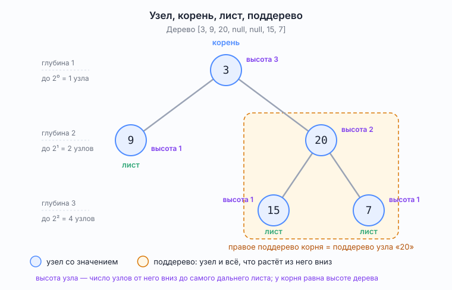
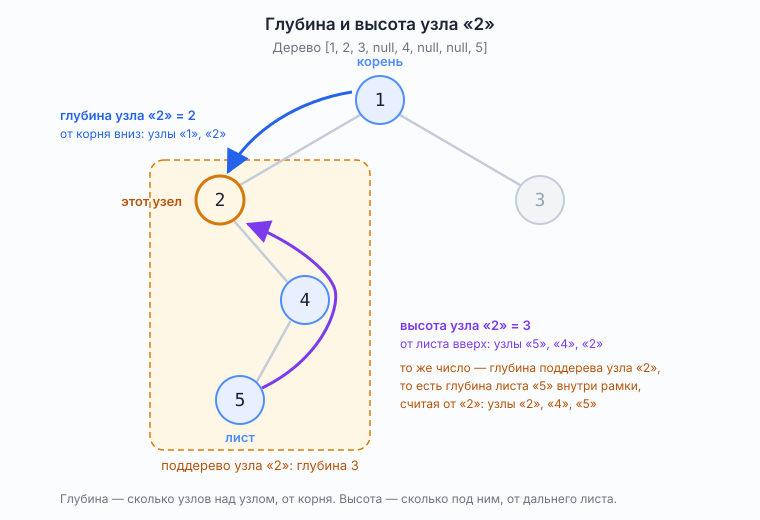
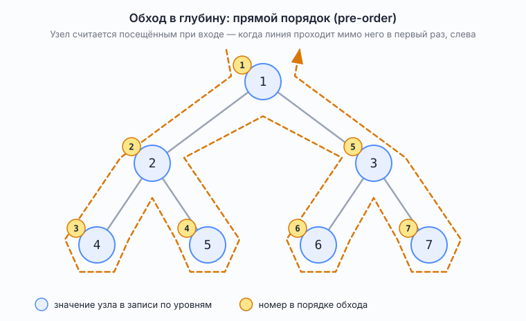
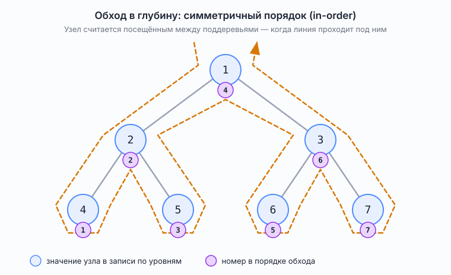
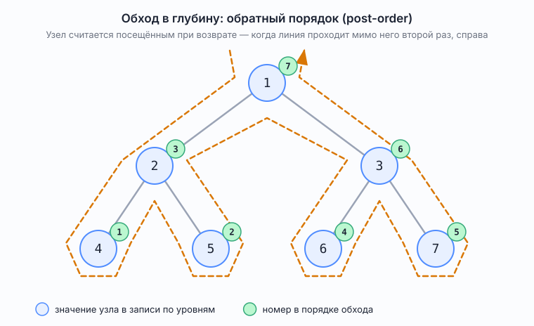
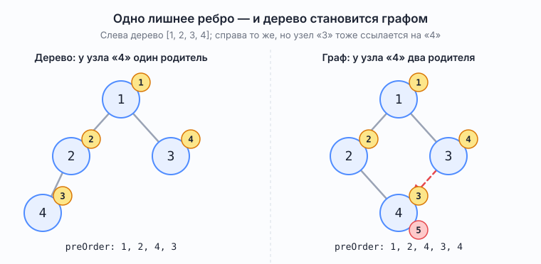
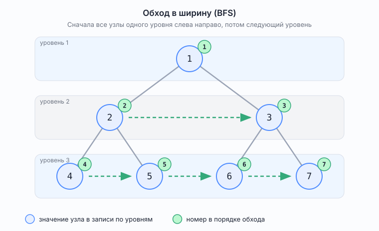

# Двоичное дерево

*Класс `TreeNode` из условий LeetCode; в стандартной библиотеке Java готового типа «дерево» нет*

Справочник по устройству дерева и способам его обхода — в объёме собеседования. Порядки обхода проверены запуском
`src/demo/TreeTraversals.java` на JDK 25 (JetBrains Runtime), вывод приведён ниже.

## Что это

Дерево — структура из узлов, где у каждого узла есть не больше одного родителя и сколько угодно потомков, а циклов нет:
спускаясь от узла вниз, в него же не вернёшься.

Двоичное (бинарное) дерево — дерево, в котором у каждого узла не больше двух потомков, и они различаются: левый и
правый. Потомок может быть один, и тогда важно, какой именно: дерево с одним левым потомком и дерево с одним правым —
разные деревья. Именно эта «двоичность» даёт в коде два поля `left` и `right` вместо списка потомков, два рекурсивных
вызова в каждом обходе и формулы с двойкой ниже. Всё в этом справочнике — про двоичные деревья.

Рисуют дерево корнем вверх, в отличие от настоящего: верх — корень, низ — листья. Поэтому «вниз» везде в тексте значит
«к потомкам», «вверх» — «к родителю и дальше к корню», а «снизу вверх» — «сначала у листьев, потом у их родителей,
последним у корня».



*Рис. 1. Узел, корень, лист и поддерево на дереве `[3, 9, 20, null, null, 15, 7]`; слева — глубина каждого уровня, у
узлов — их высота*

Три формулы, которые пригодятся дальше; в них `n` — число узлов в дереве, `h` — высота дерева (число уровней), `k` —
номер уровня (у корня `k = 1`), `nₖ` — число узлов на уровне `k`.

`nₖ ≤ 2ᵏ⁻¹` — уровень не шире удвоенного предыдущего.  
`n = 2ʰ − 1` — для полного дерева, где все уровни заполнены.  
`⌈log₂(n + 1)⌉ ≤ h ≤ n` — самое плотное дерево слева, цепочка справа.

Откуда они берутся — ниже, в разделе «Откуда берутся три формулы».

Термины, которые нужны постоянно:

| Термин            | Что это                                                 | На рис. 1                               |
|-------------------|---------------------------------------------------------|-----------------------------------------|
| узел              | элемент дерева: значение плюс ссылки на потомков        | любой кружок                            |
| корень            | единственный узел без родителя; с него начинается всё   | `3`                                     |
| потомок, родитель | узел, на который есть ссылка, и узел, который её хранит | `20` — потомок `3`, `3` — родитель `20` |
| лист              | узел без потомков                                       | `9`, `15`, `7`                          |
| поддерево узла    | сам узел и всё, что растёт из него вниз, до листьев     | рамка вокруг `20`, `15`, `7`            |

Поддерево — тоже дерево, только корнем у него стоит выбранный узел. На этом держится рекурсия: любой вопрос про дерево
можно задать каждому из поддеревьев и сложить ответы. Поддерево берётся целиком: узел `20` без `15` и `7` поддеревом не
является.

### Глубина, высота, уровень

Слова, которые путают. Здесь и во всех разборах блока всё считается в узлах, как на LeetCode: путь измеряется числом
узлов на нём, уровни нумеруются с единицы. В учебниках тот же путь измеряют в рёбрах, и все числа получаются на единицу
меньше — об этом отдельный раздел «Счёт в рёбрах: как в учебниках» в конце файла, сюда его не смешиваем.

| Термин         | Что это                                                                                                              | На рис. 1                  |
|----------------|----------------------------------------------------------------------------------------------------------------------|----------------------------|
| глубина узла   | сколько узлов на пути от корня до него включительно                                                                  | у `15` глубина 3           |
| высота узла    | сколько узлов на самом длинном пути от него вниз до листа                                                            | у `20` высота 2            |
| высота дерева  | высота корня                                                                                                         | 3                          |
| глубина дерева | глубина самого глубокого листа; то же число, что высота дерева, — тот же путь, только назван от корня, а не от листа | 3, у `15` и `7`            |
| уровень        | все узлы одной глубины                                                                                               | уровень 2 — это `9` и `20` |

Высота узла — это всегда выбор из двух путей. От узла вниз ведут две дороги: через левого потомка и через правого, и они
могут быть разной длины. Высотой считается длинная. На рис. 1 от корня `3` через `9` путь состоит из двух узлов (`3`,
затем `9`), а через `20` — из трёх (`3`, затем `20`, затем `15`); высота корня 3, короткий путь через `9` на неё не
влияет. У листа обеих дорог нет, поэтому его высота 1 — он один и есть весь путь. Код `maxDepth` записывает это правило
буквально: `1 + Math.max(leftDepth, rightDepth)` — единица за сам узел плюс большая из высот двух поддеревьев.

Отсюда и высота всего дерева: она равна высоте корня, то есть длине самого длинного пути от корня вниз до листа, а это
то же самое, что число уровней в дереве. На рис. 1 уровней три — и высота 3.

Глубина и высота считаются в противоположные стороны: глубина — от корня вниз к узлу, высота — от листа вверх к узлу.
Так её и считает `maxDepth`: сначала ответ появляется у листьев, потом у их родителей, последним у корня.
Поэтому у листа глубина может быть любой, а высота всегда 1; у корня глубина всегда 1, а высота равна высоте дерева. У
`9` на рис. 1 глубина 2 (второй уровень) и высота 1 (лист) — это разные числа, и путать их не надо.



*Рис. 2. Глубина и высота одного и того же узла `2` на дереве `[1, 2, 3, null, 4, null, null, 5]`: глубина — стрелка
сверху, от корня (узлы `1`, `2`, глубина 2); высота — стрелка снизу, от листа (узлы `5`, `4`, `2`, высота 3). Рамка —
поддерево узла `2`, его глубина тоже 3.*

Слово «глубина» применительно к узлу означает только расстояние от корня. Когда речь о пути вниз от узла, говорят о
высоте узла или о глубине его поддерева — это одно и то же число. На рис. 2 высота узла `2` равна 3, и глубина
поддерева узла `2` (рамка) тоже 3: это один и тот же путь `2`, `4`, `5`, только назван с разных концов. Именно поэтому
`maxDepth(root.left)` в коде — это высота левого потомка.

### Откуда берутся три формулы

Речь о формулах под рис. 1, обозначения те же.

Первая: `nₖ ≤ 2ᵏ⁻¹`. У двоичного дерева каждый узел даёт не больше двух потомков, поэтому уровень не может быть шире
удвоенного предыдущего: `n₁ = 1`, `n₂ ≤ 2`, `n₃ ≤ 4`, `n₄ ≤ 8`.

Вторая: `n = 2ʰ − 1` для полного дерева. Это сумма всех уровней: `n = 1 + 2 + 4 + … + 2ʰ⁻¹ = 2ʰ − 1`. На рис. 1
`h = 3`, `n = 2³ − 1 = 7`.

Третья: `⌈log₂(n + 1)⌉ ≤ h ≤ n`. Это вторая формула, решённая относительно `h`. Из `n = 2ʰ − 1` следует `n + 1 = 2ʰ`,
откуда `h = log₂(n + 1)` — точное равенство для полного дерева: `n = 7`, `h = log₂ 8 = 3`. Если последний уровень
заполнен не до конца, `n` лежит между двумя полными деревьями, `2ʰ⁻¹ − 1 < n ≤ 2ʰ − 1`, логарифм получается дробным,
а уровней — целое число, ближайшее сверху: `h = ⌈log₂(n + 1)⌉`. Для `n = 5` это `h = ⌈log₂ 6⌉ = ⌈2,58⌉ = 3` — пять
узлов в два уровня не уместить, там `n ≤ 3`. Для `n = 10⁴` выходит `h = 14`. Это левая граница, самое плотное дерево.
Правая граница — цепочка, где на каждом уровне по одному узлу: `h = n`.

Именно поэтому оценки памяти обходов ниже даны через высоту и ширину, а не через `n`: на одном и том же `n` высота
может быть и `14`, и `10⁴`.

## Двоичное дерево и его запись в Java

«Не больше двух потомков, левый и правый» из определения выше видно прямо по типу:

```java
public class TreeNode {
    public int val;
    public TreeNode left;
    public TreeNode right;
}
```

Полей-ссылок ровно два, третьего потомка хранить негде. Отсутствующий потомок — это `null`, и он же обозначает пустое
дерево: метод, принимающий `TreeNode root`, обязан быть готов к `root == null`.

В условиях задач дерево задают массивом по уровням: `[3, 9, 20, null, null, 15, 7]`. Как читать такую запись и почему к
ней нельзя применять формулы `2i + 1` — в [`TreeNotation.md`](../problems/block06_trees_graphs/TreeNotation.md). В
проекте запись собирает `TreeNode.fromLevelOrder`, обратно переводит `TreeNode.toLevelOrder`.

## Обходы

Обход (traversal, от глагола traverse — «пройти насквозь, пересечь») — способ побывать в каждом узле ровно один раз.
Семейств два, и различаются они тем, какую структуру держат под рукой: обход в глубину — стек, обход в ширину — очередь.

### Обход в глубину (DFS): одна линия, три порядка

Рекурсивный обход в глубину идёт от корня влево до упора, потом возвращается на шаг и идёт вправо. Если провести линию
так, чтобы дерево всё время оставалось по левую руку, она пройдёт мимо каждого узла трижды: слева при входе, снизу между
поддеревьями и справа при возврате. Три момента — три порядка обхода. Линия одна и та же, отличается лишь то, в какой
момент узел считается посещённым.



*Рис. 3. Прямой порядок (pre-order): узел посещается при входе, до поддеревьев. Порядок `1, 2, 4, 5, 3, 6, 7`*



*Рис. 4. Симметричный порядок (in-order): узел посещается между левым и правым поддеревом. Порядок
`4, 2, 5, 1, 6, 3, 7`*



*Рис. 5. Обратный порядок (post-order): узел посещается при возврате, после обоих поддеревьев. Порядок
`4, 5, 2, 6, 7, 3, 1`*

В коде это одна и та же функция, в которой строка «посетить узел» стоит на одном из трёх мест. Список `traversalOrder` —
накопитель результата: значения в том порядке, в каком узлы посещались.

```java
static void preOrder(TreeNode node, List<Integer> traversalOrder) {
    if (node == null) {
        return;
    }
    traversalOrder.add(node.val);            // до поддеревьев — прямой порядок
    preOrder(node.left, traversalOrder);
    preOrder(node.right, traversalOrder);
}

static void inOrder(TreeNode node, List<Integer> traversalOrder) {
    if (node == null) {
        return;
    }
    inOrder(node.left, traversalOrder);
    traversalOrder.add(node.val);            // между поддеревьями — симметричный
    inOrder(node.right, traversalOrder);
}

static void postOrder(TreeNode node, List<Integer> traversalOrder) {
    if (node == null) {
        return;
    }
    postOrder(node.left, traversalOrder);
    postOrder(node.right, traversalOrder);
    traversalOrder.add(node.val);            // после поддеревьев — обратный
}
```

Какой из трёх когда нужен — в разделе «Какой обход когда нужен» ниже, вместе с обходом в ширину.

`maxDepth` из блока 6 — обратный порядок: единица прибавляется к ответу только после того, как ответили оба поддерева,
поэтому листья считаются первыми, а корень последним.

Стек здесь неявный — стек вызовов. Глубина рекурсии равна высоте дерева, и на цепочке из `10⁴` узлов это `10⁴` кадров;
на JBR 25 с настройками по умолчанию проходит, на `2 · 10⁴` уже нет (проверено в `MaxDepthBinaryTree`). Если рекурсия
недопустима, тот же обход пишется с явным `ArrayDeque` в роли стека — см. [`Stack.md`](Stack.md), раздел «Рекурсия и
явный стек — это одно и то же».

### Почему в дереве нет множества посещённых узлов

В обходах графов есть множество `visited`, в которое заглядывают перед заходом в вершину: «уже были — не идём». Оно
нужно, потому что в графе к одной вершине могут вести несколько путей, а при цикле обход без него не остановится вовсе.
В коде выше такой проверки нет, и это не упущение: в дереве у каждого узла ровно один родитель, значит, к нему ведёт
ровно один путь от корня, и рекурсия встречает его ровно один раз. Дерево гарантирует то, что в графе приходится
обеспечивать множеством.

Поэтому накопитель результата и назван `traversalOrder`, а не `visited`: слово `visited` занято графовым множеством с
проверкой, а здесь список только пишется и ни на что не влияет.

Проверить разницу можно на том же `preOrder`. Возьмём дерево `[1, 2, 3, 4]` и добавим второе ребро к узлу `4`: пусть
`3.left` тоже указывает на него.



*Рис. 6. Слева дерево: у узла `4` один родитель, `preOrder` даёт `1, 2, 4, 3`. Справа то же с ребром `3 → 4`: у узла `4`
два родителя, и `preOrder` посещает его дважды — `1, 2, 4, 3, 4`. Жёлтые номера — порядок посещения, красный —
повторное*

Код `preOrder` при этом не менялся: он не проверяет, был ли уже в узле, потому что в дереве это невозможно. Стоило
появиться второму пути к узлу — и накопитель честно записал его второй раз. Если же лишнее ребро направить вверх, к
предку (например `4.left = 2`), рекурсия не остановится вовсе: `2 → 4 → 2 → 4 …` до `StackOverflowError`. Вот тогда и
появляется `visited` в графовом смысле — множество, в которое заглядывают перед заходом; это тема обходов графов, см. [
`Pattern_GraphTraversal.md`](../problems/block06_trees_graphs/Pattern_GraphTraversal.md).

### Обход в ширину (BFS): по уровням

Обход в ширину идёт слоями: сначала корень, потом все узлы глубины 2 слева направо, потом все узлы глубины 3, и так
далее.



*Рис. 7. Обход в ширину: уровень за уровнем, внутри уровня слева направо. Порядок `1, 2, 3, 4, 5, 6, 7`*

Одной линией вокруг дерева такой порядок не нарисуешь: между `3` и `4` нет ребра, а обход перескакивает. Поэтому здесь
нужна очередь — она хранит узлы, чьих потомков ещё не смотрели:

```java
static List<Integer> levelOrder(TreeNode root) {
    List<Integer> traversalOrder = new ArrayList<>();
    if (root == null) {
        return traversalOrder;
    }
    Queue<TreeNode> nodesToVisit = new ArrayDeque<>();
    nodesToVisit.add(root);
    while (!nodesToVisit.isEmpty()) {
        TreeNode node = nodesToVisit.remove();
        traversalOrder.add(node.val);
        if (node.left != null) {
            nodesToVisit.add(node.left);
        }
        if (node.right != null) {
            nodesToVisit.add(node.right);
        }
    }
    return traversalOrder;
}
```

Порядок получается ровно тот, в каком дерево записано в условии задачи: `TreeNode.fromLevelOrder` и
`TreeNode.toLevelOrder` — это обход в ширину, только очередь там уже стоит. FIFO здесь существенно: возьми вместо
очереди стек, и порядок станет одним из обходов в глубину.

### Вывод `TreeTraversals` на дереве `[1, 2, 3, 4, 5, 6, 7]`

```
pre-order   : [1, 2, 4, 5, 3, 6, 7]
in-order    : [4, 2, 5, 1, 6, 3, 7]
post-order  : [4, 5, 2, 6, 7, 3, 1]
level-order : [1, 2, 3, 4, 5, 6, 7]
```

## Какой обход когда нужен

Вариантов четыре: три момента посещения у обхода в глубину и обход в ширину. Время у всех O (n) — каждый узел трогается
один раз, — поэтому выбирают не по времени, а по двум вещам: в какой момент узел готов дать ответ и сколько памяти уйдёт
на этом дереве.

| Обход                              | Порядок на `[1..7]` | Когда нужен                                                                                                                                                                            | Память сверх дерева                                        |
|------------------------------------|---------------------|----------------------------------------------------------------------------------------------------------------------------------------------------------------------------------------|------------------------------------------------------------|
| в глубину, прямой (pre-order)      | `1 2 4 5 3 6 7`     | узел нужен **до** потомков: скопировать дерево; записать его в строку так, чтобы потом восстановить; напечатать структуру с отступами                                                  | O(h) — стек вызовов, h — высота дерева                     |
| в глубину, симметричный (in-order) | `4 2 5 1 6 3 7`     | почти только для дерева поиска: выдаёт значения по возрастанию. Задачи «k-й наименьший элемент», «проверить, что это дерево поиска»                                                    | O(h)                                                       |
| в глубину, обратный (post-order)   | `4 5 2 6 7 3 1`     | узел нужен **после** потомков — всё, что считается снизу вверх: высота (`maxDepth`), размер поддерева, диаметр, «сбалансировано ли», удаление дерева (сначала потомки, потом сам узел) | O(h)                                                       |
| в ширину (level-order)             | `1 2 3 4 5 6 7`     | важны уровни: «правый вид дерева», «максимум на каждом уровне», «минимальная глубина» (первый встреченный лист — самый близкий к корню), запись `[…]` из условия задачи                | O(w) — очередь, w — наибольшее число узлов на одном уровне |

Правило выбора: спросить себя, в какой момент узел готов дать ответ. Ответ узла зависит от ответов потомков — обратный
порядок. Узел обрабатывается сам по себе, а потомки после — прямой. В задаче звучит «уровень», «ближайший», «по слоям» —
в ширину. Симметричный — только если дерево поиска (что это такое — в [`BinarySearchTree.md`](BinarySearchTree.md)).

Про память. Обход в глубину держит в стеке путь от корня до текущего узла и платит высотой. Обход в ширину держит в
очереди целый слой и платит шириной. На цепочке из `n` узлов `h = n`, а `w = 1` — в глубину дорого, в ширину дёшево. На
полном дереве наоборот: `h ≈ log₂ n`, а нижний слой `w ≈ n / 2`. Какой обход экономнее, зависит от
формы дерева, единого ответа нет. Явный стек стоит столько же, сколько стек вызовов, — в нём лежит тот же путь от корня;
разница лишь в пределе: стек потока ограничен `-Xss`, `ArrayDeque` живёт в куче.

## Где это в проекте

- [`MaxDepthBinaryTree.md`](../problems/block06_trees_graphs/MaxDepthBinaryTree.md) — обход в глубину в обратном
  порядке: высота считается снизу вверх.
- [`TreeNotation.md`](../problems/block06_trees_graphs/TreeNotation.md) — запись по уровням; `fromLevelOrder` и
  `toLevelOrder` в `TreeNode` — обход в ширину.
- [`LevelOrderTraversal.md`](../problems/block06_trees_graphs/LevelOrderTraversal.md) — обход в ширину как задача: тот
  же цикл с очередью плюс граница уровня через размер очереди.
- `src/demo/TreeTraversals.java` — четыре обхода на одном дереве с проверками.

## Счёт в рёбрах: как в учебниках

Весь справочник выше считает в узлах, как LeetCode. Этот раздел — про другую единицу счёта, принятую в учебниках; к
разборам блока он не относится и нужен только для того, чтобы не растеряться, встретив у Кормена или на собеседовании
числа на единицу меньше.

Учебное определение — у Кормена и др. («Алгоритмы: построение и анализ», приложение B.5.2): глубина узла — длина пути от
корня до него; высота узла — длина самого длинного пути вниз от него до листа; высота дерева — высота корня. Длина пути
измеряется числом рёбер, то есть переходов между узлами, а не числом узлов. Само определение то же, что и выше, — «самый
длинный путь вниз», отличается только единица.

Что от этого меняется:

|                                  | В узлах (LeetCode, этот справочник) | В рёбрах (учебники) |
|----------------------------------|-------------------------------------|---------------------|
| глубина корня                    | 1                                   | 0                   |
| высота листа                     | 1                                   | 0                   |
| высота дерева на рис. 1          | 3                                   | 2                   |
| дерево из одного узла            | глубина 1                           | глубина 0           |
| номер первого уровня             | 1                                   | 0                   |
| узлов на уровне `k`              | `nₖ ≤ 2ᵏ⁻¹`                         | `nₖ ≤ 2ᵏ`           |
| узлов в полном дереве высоты `h` | `n = 2ʰ − 1`                        | `n = 2ʰ⁺¹ − 1`      |

Каждое число в правом столбце ровно на единицу меньше левого, потому что на пути из `m` узлов всегда `m − 1` рёбер.
Формулы с уровнями сдвигаются по той же причине: уровень с одним корнем при счёте в рёбрах имеет номер 0, и `2⁰ = 1`;
при счёте в узлах он имеет номер 1, показатель `k − 1` равен нулю, и снова `2⁰ = 1`. Само дерево при этом не меняется,
меняется только нумерация.

LeetCode в задаче 104 говорит прямо: «number of nodes along the longest path», поэтому у дерева из одного узла глубина

1. На собеседовании стоит спросить, что считают — узлы или рёбра, — до того как называть ответ.

## Типичные вопросы на собеседовании

**Чем глубина отличается от высоты?**
Глубина считается от корня вниз до узла, высота — от самого дальнего листа вверх до узла. У корня высота равна высоте
всего дерева, у листа высота 1.

**Чем обход в глубину отличается от обхода в ширину?**
Структурой, которую держим под рукой: в глубину — стек (обычно неявный, стек вызовов), в ширину — очередь. В глубину
уходит вдоль одной ветки до упора, в ширину идёт слоями.

**Какие есть порядки обхода в глубину?**
Прямой (узел, левое, правое), симметричный (левое, узел, правое), обратный (левое, правое, узел). Код один, отличается
место строки «посетить узел».

**Какой порядок даёт отсортированный вывод у дерева поиска?**
Симметричный.

**Какой порядок нужен, чтобы посчитать высоту?**
Обратный: узел отвечает после обоих потомков.

**Сколько памяти занимает обход?**
В глубину — высота дерева (стек), в ширину — ширина самого широкого уровня (очередь). У цепочки из n узлов первое равно
n, второе 1; у полного дерева наоборот, log n против n / 2.

**Можно ли обойти дерево в глубину без рекурсии?**
Да, явным стеком: положить корень, в цикле снимать узел и класть его потомков. Порядок зависит от того, в какой момент
узел обрабатывается и в каком порядке кладутся потомки.

## См. также

- [`BinarySearchTree.md`](BinarySearchTree.md) — двоичное дерево поиска: правило порядка, сбалансированность
- [`Queue.md`](Queue.md) — очередь, на которой держится обход в ширину
- [`Stack.md`](Stack.md) — стек, рекурсия и явный стек
- [`TreeNotation.md`](../problems/block06_trees_graphs/TreeNotation.md) — как дерево записано в условии задачи
- [`Pattern_GraphTraversal.md`](../problems/block06_trees_graphs/Pattern_GraphTraversal.md) — обходы на графах:
  `traversalOrder`, кратчайший путь (черновик)
- [`glossary.md`](../glossary.md) — поддерево; прямой, симметричный и обратный порядок обхода
