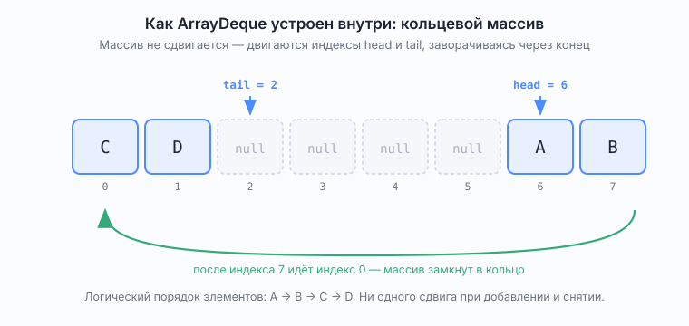

# Deque — двусторонняя очередь

*Интерфейс `java.util.Deque<E>`, произносится «дэк», от double ended queue*

Справочник в объёме собеседования. Проверено на JDK 25 (JetBrains Runtime).

## Что это

Очередь, у которой **оба конца равноправны**: вставлять и извлекать можно и спереди, и сзади. Обычная `Queue` умеет добавлять только в хвост и снимать только с головы, `Deque` снимает это ограничение.

```
            addFirst(e)         addLast(e)
                 │                   │
                 ▼                   ▼
            ┌─────────┬─────────┬─────────┐
            │    A    │    B    │    C    │
            └─────────┴─────────┴─────────┘
                 ▲                   ▲
                 │                   │
            pollFirst()         pollLast()

               first               last
             (голова)            (хвост)
```

*Рис. 1. Двусторонняя очередь: вставка и извлечение с обоих концов*

Четыре операции вместо двух: вставить можно с любого конца и снять тоже с любого. Заглянуть, не снимая, — `peekFirst()` и `peekLast()`. Все шесть — за `O(1)`.

## Чем отличается от Queue

Формально: `Deque<E> extends Queue<E>`. То есть `Deque` — это `Queue` плюс операции со второго конца.

```
                       [И] Collection<E>
                               │
                               │ extends
                       [И] Queue<E>
                               │
                ┌──────────────┴──────────────┐
                │ extends                     │ implements
          [И] Deque<E>                  [А] AbstractQueue<E>
                │                             │ extends
                │                       [К] PriorityQueue<E>
        ┌───────┴───────────┐           НЕ FIFO — двоичная куча
        │ implements        │ implements
[К] ArrayDeque<E>    [К] LinkedList<E>
кольцевой массив,    двусвязный список,
null запрещён        допускает null
```

*Рис. 2. Место Queue и Deque в иерархии java.util*

Обозначения: `[И]` интерфейс · `[А]` абстрактный класс · `[К]` класс. Через `new` создаётся только `[К]`.

Читается сверху вниз: чем ниже, тем конкретнее. `Collection` требует уметь добавлять, удалять, считать размер и обходить; `Queue` добавляет вход в один конец и выход из другого; `Deque` уравнивает оба конца. `AbstractQueue` — заготовка с уже написанной общей частью, чтобы каждая очередь не переписывала одно и то же; экземпляр её создать нельзя.

Объявления из исходников JDK 25, если захочется свериться:

```java
public interface Queue<E> extends Collection<E>
public interface Deque<E> extends Queue<E>, SequencedCollection<E>
public abstract class AbstractQueue<E> extends AbstractCollection<E> implements Queue<E>
public class ArrayDeque<E> extends AbstractCollection<E> implements Deque<E>, Cloneable, Serializable
public class LinkedList<E> extends AbstractSequentialList<E> implements List<E>, Deque<E>, Cloneable, Serializable
public class PriorityQueue<E> extends AbstractQueue<E> implements Serializable
```

Из последней строки, кстати, видно, что `PriorityQueue` — это `Queue`, но не `Deque`: второго конца у неё нет.

Практическая разница:

| | `Queue` | `Deque` |
|---|---------|---------|
| Вставка | только в хвост | в оба конца |
| Извлечение | только из головы | из обоих концов |
| Дисциплина | FIFO | FIFO **и** LIFO — как захочешь |
| Может быть стеком | нет | да |
| Отношение | родитель | наследник |

Из наследования следует практический вывод: **любой `Deque` можно передать туда, где ждут `Queue`**, но не наоборот. Поэтому в коде часто пишут `Queue<T> q = new ArrayDeque<>()` — тип переменной сужают до `Queue`, чтобы объявить намерение использовать только FIFO.

Ключевое различие, о котором стоит сказать словами: `Queue` — это про **дисциплину** (один вход, один выход), `Deque` — про **возможности** (четыре операции вместо двух). Deque не навязывает дисциплину, её выбирает тот, кто пишет код: пользуешься одним концом — получил стек, двумя разными — получил очередь.

## Методы: три группы имён для одних и тех же действий

Здесь легко запутаться, поэтому разложим по полочкам. У `Deque` двенадцать основных методов — это шесть операций (вставка/извлечение/просмотр × начало/конец) в двух вариантах поведения при неудаче.

### Основные — явные имена концов

| Операция | Начало (first) | Конец (last) | Поведение при неудаче |
|----------|----------------|--------------|------------------------|
| Вставить | `addFirst(e)` | `addLast(e)` | исключение |
| Вставить | `offerFirst(e)` | `offerLast(e)` | `false` |
| Извлечь | `removeFirst()` | `removeLast()` | `NoSuchElementException` |
| Извлечь | `pollFirst()` | `pollLast()` | `null` |
| Посмотреть | `getFirst()` | `getLast()` | `NoSuchElementException` |
| Посмотреть | `peekFirst()` | `peekLast()` | `null` |

### Унаследованные от Queue

Работают так, как если бы это была обычная FIFO-очередь: вставка в конец, извлечение из начала.

| Метод `Queue` | Эквивалент в `Deque` |
|---------------|----------------------|
| `add(e)` / `offer(e)` | `addLast(e)` / `offerLast(e)` |
| `remove()` / `poll()` | `removeFirst()` / `pollFirst()` |
| `element()` / `peek()` | `getFirst()` / `peekFirst()` |

### Стековые

Работают с одним концом — началом.

| Метод «как у стека» | Эквивалент в `Deque` |
|---------------------|----------------------|
| `push(e)` | `addFirst(e)` |
| `pop()` | `removeFirst()` |
| `peek()` | `peekFirst()` |

Способ запомнить всю таблицу одной фразой: **очередные методы работают с разными концами, стековые — с одним и тем же (началом)**.

## Deque как стек — и почему класс Stack не нужен

```
           push(e)   pop()
              │        ▲
              ▼        │
        ┌─────────────────────┐
        │          C          │  ← вершина (first), её возвращает peek()
        ├─────────────────────┤
        │          B          │
        ├─────────────────────┤
        │          A          │  ← дно: вошло первым, выйдет последним
        └─────────────────────┘

        второй конец не используется — работаем только верхним
```

*Рис. 3. Deque в роли стека: обе операции на одном конце*

Порядок выхода `C → B → A`, обратный порядку входа. Это и есть LIFO.

Современная Java не использует `java.util.Stack`. Причины, которые ждут услышать:

1. `Stack` наследует `Vector`, а `Vector` — синхронизированная коллекция из Java 1.0. Ты платишь за блокировки, даже когда работаешь в одном потоке.
2. `Stack` наследует `Vector`, а значит наследует и весь интерфейс `List` — включая доступ по индексу и вставку в середину. Структура, которая должна давать ровно три операции, разрешает делать что угодно. Это дырявая абстракция.
3. Самое неприятное — у `Stack` **порядок итерации перевёрнут** относительно ожидаемого: он итерируется от дна к вершине, потому что это `Vector`. У `ArrayDeque` итерация идёт от вершины, то есть в порядке снятия.

Проверено на `ArrayDeque`:

```
push(1); push(2); push(3);
toString() -> [3, 2, 1]      // от вершины к дну, порядок снятия
pop()      -> 3
```

Правильный ответ на «как сделать стек в Java»: `Deque<T> stack = new ArrayDeque<>();`

## ArrayDeque изнутри

Это второй по частоте вопрос после «чем отличается от Queue». Реализация — **кольцевой массив** (в оригинале circular array).

### Что такое кольцевой массив

Обычный массив имеет начало и конец, и это создаёт проблему для очереди. Сняли элемент с головы — освободилась ячейка `[0]`. Что с ней делать? Наивный вариант — сдвинуть все оставшиеся элементы на одну позицию влево, но это `O(n)` на каждое снятие, то есть очередь работает медленно на ровном месте.

Кольцевой массив решает это так: **массив не трогаем вообще, вместо элементов двигаются границы**. Заводим два индекса — `head` (где лежит первый элемент) и `tail` (куда положить следующий с конца). Сняли с головы — просто увеличили `head`. Освободившаяся ячейка не заполняется дырой в структуре, она становится «зарезервированной под будущее».

Слово «кольцевой» появляется из-за того, что происходит на краю. Когда `tail` доходит до последней ячейки массива и надо положить ещё элемент, он не упирается в конец, а **заворачивается на нулевую позицию** — если та уже свободна. Логически это значит, что после последней ячейки массива идёт нулевая, то есть массив замкнут в кольцо. Физически, конечно, никакого кольца нет: есть обычный линейный массив и арифметика над индексами.



*Рис. 4. Кольцевой массив внутри ArrayDeque: head, tail и заворот через край*

На схеме видно, к чему это приводит: элементы `A, B, C, D` лежат в памяти «разорванно» — `A, B` в хвосте массива, `C, D` в начале, — но логический порядок сохраняется, потому что читать надо от `head`, заворачиваясь через край.

Заворот делается элементарно: `if (++i >= length) i = 0` при движении вперёд и `if (--i < 0) i = length - 1` при движении назад. Именно так это и написано в исходниках JDK 25 (методы `inc` и `dec`).

Отличать от кольцевого списка: там кольцо настоящее — последний узел ссылается на первый. Здесь кольцо только в правиле пересчёта индекса.

### Про сам термин

Единого закреплённого перевода на русский нет. В исходниках JDK и в англоязычной литературе термин один — **circular array**. По-русски его передают по-разному: в русском издании Макдауэлл (лежит в `rag/`) — **«циклический массив»**, здесь используется **«кольцевой массив»**, встречается и **«кольцевой буфер»**. Все три означают одно и то же, на собеседовании поймут любой.

Идея: массив фиксированного размера плюс два индекса — `head` (где лежит первый элемент) и `tail` (куда положить следующий с конца). Добавление в начало уменьшает `head`, добавление в конец увеличивает `tail`. Когда индекс выходит за границу массива, он заворачивается на другой конец. Поэтому элементы в памяти могут лежать «разорванно» (в примере на схеме: A, B в конце массива, C, D в начале), но логический порядок сохраняется.

Главное следствие: **ни одна операция с концами не требует сдвига элементов**. В отличие от `ArrayList`, где вставка в начало сдвигает весь массив за `O(n)`.

Детали из исходников JDK 25, которые не грех знать:

- начальная ёмкость — массив на **17 слотов**: 16 полезных плюс один всегда пустой. Пустой слот нужен, чтобы различать «пусто» и «полностью занято» — иначе оба состояния дали бы `head == tail`;
- рост: пока ёмкость меньше 64, массив увеличивается примерно вдвое (`+ oldCapacity + 2`), дальше — в полтора раза (`+ oldCapacity / 2`). Проверено: свежий массив 17 слотов, после 17 добавлений — 36;
- **распространённое устаревшее утверждение**: «ёмкость всегда степень двойки, а индекс считается через `& (length - 1)`». В старых версиях так и было, но в актуальном JDK ёмкость произвольная, а заворот индекса делают явные методы `inc`/`dec` с проверкой `if (++i >= modulus) i = 0`. Если скажешь про степень двойки — формально ошибёшься.

### null запрещён

`ArrayDeque` не принимает `null` — бросает `NullPointerException`. Проверено:

```
new ArrayDeque<>().add(null)   -> NullPointerException
new LinkedList<>().add(null)   -> ok
```

Причина не в придирчивости, а в дизайне: `poll()` и `peek()` возвращают `null` как признак «пусто». Если бы `null` можно было хранить, ответ `null` стал бы неоднозначным — то ли очередь пуста, то ли в ней лежит `null`.

### Не потокобезопасен

`ArrayDeque` не синхронизирован. Многопоточный аналог — `ConcurrentLinkedDeque` или `LinkedBlockingDeque`.

## Реализации Deque

| Класс | Внутри | Особенности |
|-------|--------|-------------|
| `ArrayDeque` | кольцевой массив | быстрый, компактный, **null запрещён**, выбор по умолчанию |
| `LinkedList` | двусвязный список | ещё и `List`, допускает `null`, хуже по памяти и кэшу |
| `ConcurrentLinkedDeque` | список на CAS | потокобезопасный, неблокирующий |
| `LinkedBlockingDeque` | список с блокировками | потокобезопасный, блокирующий, можно ограничить ёмкость |

Все операции с концами у `ArrayDeque` и `LinkedList` — `O(1)` (у `ArrayDeque` вставка амортизированная из-за расширения массива). Поиск и удаление произвольного элемента — `O(n)` у обоих.

## Дополнительные методы, о которых стоит знать

- `descendingIterator()` — обход от конца к началу. Проверено: для `[1, 2, 3]` даёт `3 2 1`. Удобно, когда нужно пройти накопленное в обратном порядке, не разворачивая коллекцию.
- `removeFirstOccurrence(o)` / `removeLastOccurrence(o)` — удалить первое или последнее вхождение значения, `O(n)`.

## Где Deque нужен в алгоритмах

**Стек** — самое частое. Проверка скобок, вычисление постфиксной записи, обход в глубину без рекурсии, задача «следующий больший элемент» (монотонный стек).

**Обычная FIFO-очередь** — обход в ширину.

**Скользящее окно максимума** (задача 239) — классический случай, где нужны именно оба конца: в дек кладут индексы, с хвоста выталкивают всех, кто меньше нового элемента, с головы выбрасывают тех, кто вышел из окна. Получается монотонный дек и `O(n)` вместо `O(n·k)`. Это самая известная задача, где обычной очереди недостаточно.

## Типичные вопросы на собеседовании

**Чем `Deque` отличается от `Queue`?**
`Deque` наследует `Queue` и добавляет операции со второго конца. `Queue` — только FIFO, `Deque` может работать и как FIFO, и как LIFO.

**Как в Java сделать стек?**
`Deque<T> stack = new ArrayDeque<>()`. `java.util.Stack` устарел: он наследует синхронизированный `Vector`, тянет за собой интерфейс `List` и итерируется от дна к вершине.

**Как устроен `ArrayDeque` внутри?**
Кольцевой массив с индексами `head` и `tail`, заворачивающимися через границу. Никаких сдвигов при работе с концами, все операции `O(1)` амортизированно.

**Почему `ArrayDeque` не принимает `null`?**
Потому что `null` — сигнальное значение для `poll()` и `peek()`, означающее «коллекция пуста». Разрешить хранить `null` — сделать ответ неоднозначным.

**`ArrayDeque` или `LinkedList`?**
`ArrayDeque` почти всегда: меньше памяти, лучше локальность, быстрее. `LinkedList` — если нужен `null` или одновременно требуется интерфейс `List`.

**Deque потокобезопасен?**
`ArrayDeque` и `LinkedList` — нет. Потокобезопасные варианты: `ConcurrentLinkedDeque`, `LinkedBlockingDeque`.

## См. также

- [`Queue.md`](Queue.md) — базовый интерфейс, шесть методов, `PriorityQueue`, блокирующие очереди
- Задача на стеке: [`docs/problems/block02_strings_stack/ValidParentheses.md`](../problems/block02_strings_stack/ValidParentheses.md)
- Официальная документация: <https://docs.oracle.com/en/java/javase/25/docs/api/java.base/java/util/Deque.html>
