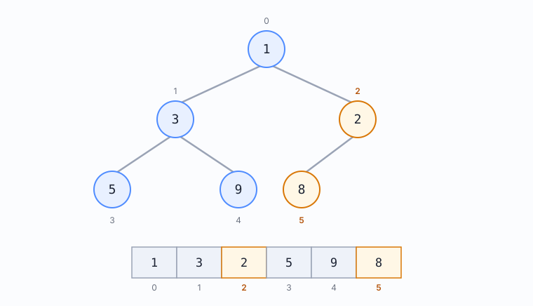
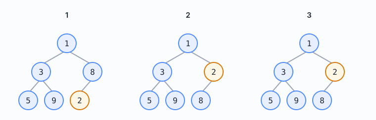
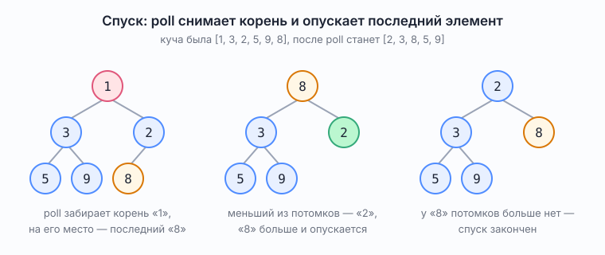

# PriorityQueue — очередь по приоритету

Справочник по одной реализации `Queue`. В [`Queue.md`](Queue.md) про неё сказано коротко — как про ловушку «`Queue`, но не FIFO». Здесь разбирается устройство: что за структура лежит внутри, почему операции стоят `O(log n)`, и где эта структура встречается — в самой библиотеке Java и в прикладном коде.

Все числа и выводы ниже получены запуском `demo.PriorityQueueDemo` на JDK 25 (JetBrains Runtime); детали внутреннего устройства сверены с исходниками из `src.zip` той же JDK.

## Что гарантируется, а что нет

`PriorityQueue` реализует интерфейс `Queue`, но порядок выдачи у неё не «кто раньше встал», а «у кого меньше значение» — по натуральному порядку или по переданному `Comparator`.

Гарантия ровно одна: **в корне лежит наименьший элемент**, и его возвращает `peek()`. Всё остальное не обещано: ни порядок обхода итератором, ни порядок между элементами с равным приоритетом.

`null` в очередь положить нельзя — его не с чем сравнивать:

```
offer(null) -> NullPointerException, очередь осталась пустой
```

Это та же причина, по которой `null` не принимает `ArrayDeque`; на ней построено решение `SymmetricTreeIterative` из блока 6, где проверки пришлось перенести с момента снятия на момент укладки.

## Куча внутри массива

Внутри лежит **двоичная куча** (binary heap) — двоичное дерево с двумя свойствами:

1. дерево **плотное**: все уровни заполнены слева направо, пропусков внутри нет;
2. выполняется **правило кучи**: значение каждого узла не больше значений его потомков.

Правило кучи слабее, чем правило дерева поиска: оно связывает узел только с его потомками, а между соседями слева и справа порядка нет. Поэтому куча не даёт отсортированный обход, зато поддерживается дешевле.



*Рис. 1. Куча после `offer` в порядке 5, 3, 8, 1, 9, 2: сверху дерево, снизу тот же набор массивом. Серые числа рядом с узлами и под ячейками — индексы в массиве. Правило кучи видно на каждом узле: родитель не больше своих потомков. Оранжевым отмечены узел `2` и его левый потомок `8` — узел стоит на индексе 2, потомок на индексе 2 · 2 + 1 = 5.*

Хранится дерево массивом, без ссылок на потомков. Обозначения: `i` — индекс узла в массиве, `l` и `r` — индексы его левого и правого потомков, `p` — индекс родителя. Тогда

```
l = 2i + 1
r = 2i + 2
p = (i - 1) / 2
```

деление целочисленное. Это в точности «полное представление» из [`TreeNotation.md`](../problems/block06_trees_graphs/TreeNotation.md), и здесь оно работает без оговорок — именно потому, что куча плотная. В записи из условия задачи применять эту арифметику нельзя: там у пустых узлов места под детей не зарезервированы, и после первого же внутреннего пропуска индексы перестают сходиться.

В исходнике `PriorityQueue` те же формулы записаны сдвигами: родитель — `(k - 1) >>> 1`, левый потомок — `(k << 1) + 1`, правый — `child + 1`.

Плотность даёт и высоту. Если `n` — число узлов, `h` — высота дерева в узлах (как принято в [`BinaryTree.md`](BinaryTree.md)), то `h = ⌊log₂ n⌋ + 1`. На картинке выше `n = 6`, и высота равна трём. Отсюда все `O(log n)`: и подъём, и спуск проходят один путь от корня к листу.

## Как куча выглядит в исходном коде

Всё, из чего состоит `PriorityQueue`, — четыре поля. `java.base/java/util/PriorityQueue.java`, строки 95–121; комментарии-джавадоки над полями здесь убраны, их содержание разобрано ниже по-русски:

```java
transient Object[] queue;

int size;

@SuppressWarnings("serial")
private final Comparator<? super E> comparator;

transient int modCount;
```

Главное здесь — чего нет. Ни класса узла, ни полей `left` и `right`, ни ссылки на корень: в коде нет ни одного объекта, который представлял бы узел или ребро. Дерево существует только как договорённость о том, как читать индексы массива. Записана эта договорённость в комментарии над `queue`, а исполняется в `siftUp` и `siftDown`. Поэтому куча и не хранит ссылок, а занимает ровно один массив.

Тот комментарий над `queue` — это и есть определение кучи. В нём три утверждения.

1. Два потомка узла с индексом `n` лежат в ячейках `2n + 1` и `2n + 2` — та же арифметика индексов, что выше. В исходнике правая записана как `2 * (n + 1)`, это одно и то же число.
2. Для каждого узла кучи и каждого узла его поддерева выполняется «родитель не больше». Правило записано не только для прямых потомков, а для всей ветки вниз. Одно следует из другого, но на собеседовании удобнее произносить именно эту, сильную форму.
3. Наименьший элемент лежит в `queue[0]`, если очередь не пуста — та самая единственная гарантия, которую даёт очередь.

## Остальные три поля класса

У `queue` и `modCount` в исходнике стоит пометка, что они намеренно объявлены не `private`: к ним обращается вложенный класс `Itr`.

### 1. `size`

#### Что хранит
Сколько ячеек массива занято.

#### Что из этого следует
Длина массива больше: в нём есть запас под рост. Границу дерева задаёт именно `size`, и от него в `siftDown` считается `half` — индекс первого листа.

### 2. `comparator`

#### Что хранит
Компаратор, `null` означает натуральный порядок.

#### Что из этого следует
Поле `final`, и проверка на `null` делается один раз на входе в `siftUp` или `siftDown`, а не на каждом сравнении. Отсюда и раздвоение методов на `…Comparable` и `…UsingComparator`.

### 3. `modCount`

#### Что хранит
Число структурных изменений очереди.

#### Что из этого следует
Итератор fail-fast: вложенный класс `Itr` бросает `ConcurrentModificationException`, если очередь изменили в обход итератора.

## offer: подъём

Новый элемент кладётся в конец массива — это единственное место, где плотность не нарушается, — и поднимается, пока он меньше родителя.



*Рис. 2. Подъём при `offer`: куча была `[1, 3, 8, 5, 9]`, добавляется `2`. Панель 1 — новый узел встал в конец массива, на индекс 5. Панель 2 — `2` меньше `8`, узлы поменялись местами. Панель 3 — `2` не меньше `1`, подъём закончен; в массиве `[1, 3, 2, 5, 9, 8]`. Оранжевым отмечен поднимающийся узел.*

Проверено запуском: после `offer` в порядке 5, 3, 8, 1, 9, 2 массив выглядит так.

```
[1, 3, 2, 5, 9, 8]
```

В исходнике это `siftUp`, и у него две версии — `siftUpComparable` для натурального порядка и `siftUpUsingComparator` для своего компаратора. Разница только в том, чем сравнивают; ход подъёма одинаковый.

Обмена «поменять местами» в коде нет: родитель сдвигается вниз, а новое значение записывается один раз, когда подъём закончен. Записей в массив выходит по одной на уровень плюс одна в конце — вместо двух на уровень при обмене.

## poll: спуск

Корень отдаётся наружу, на его место встаёт последний элемент массива — и опускается, меняясь с меньшим из потомков, пока не окажется не больше их обоих. Если правого потомка нет, сравнивать не с чем и берётся левый.



*Рис. 3. Спуск при `poll`: куча была `[1, 3, 2, 5, 9, 8]`. Панель 1 — розовым корень `1`, который уходит наружу, оранжевым последний узел `8`, который встанет на его место. Панель 2 — зелёным меньший из потомков, `2`; опускаемый `8` больше него. Панель 3 — у `8` потомков больше нет, спуск закончен; в массиве `[2, 3, 8, 5, 9]`.*

Проверено запуском: из кучи `[1, 3, 2, 5, 9, 8]` после одного `poll` получается

```
[2, 3, 8, 5, 9]
```

Меняться нужно именно с МЕНЬШИМ потомком: если поменяться с большим, тот окажется выше меньшего и правило кучи сломается на следующем же уровне.

Спуск останавливается, как только текущая позиция оказывается листом: в коде цикл идёт, пока `k < half`, где `half = n >>> 1` — индекс первого листа в массиве. У листа потомков нет, и сравнивать больше не с чем.

## Порядок внутри — это не порядок выдачи

Самая частая ошибка при чтении отладчика. Массив кучи не отсортирован, и `toString()` с `iterator()` показывают именно его:

```
порядок массива : [1, 3, 2, 5, 9, 8]
порядок выдачи  : [1, 2, 3, 5, 8, 9]
```

Отсортированную последовательность даёт только последовательный `poll()`. Если нужен отсортированный список без разрушения очереди, кучу копируют и опустошают копию либо берут `new ArrayList<>(queue)` и сортируют его отдельно.

Компаратор переворачивает порядок целиком. Тот же набор чисел с `Comparator.reverseOrder()`:

```
порядок выдачи  : [9, 8, 5, 3, 2, 1]
```

## Равные приоритеты: порядок не обещан

Куча **не устойчива**: два элемента с равным приоритетом могут выйти в любом порядке, и он зависит от того, как они легли в массив. Это видно на трёх платежах, где `P-1` и `P-2` относятся к одному классу обслуживания, а `P-1` пришёл раньше:

```
сравнение только по классу       : [P-2, P-1, P-3]
класс, затем время поступления   : [P-1, P-2, P-3]
```

В первой строке платёж, пришедший позже, вышел первым. Никакой ошибки тут нет: документация такого порядка и не обещает. Лечится вторым ключом сравнения — временем поступления или сквозным номером:

```java
Comparator.comparingInt(Payment::serviceClass)
          .thenComparingLong(Payment::receivedAtMillis)
```

Про устойчивость как свойство решения — в [`docs/algorithm-properties.md`](../algorithm-properties.md).

## Сложность операций

| Операция | Стоимость | Почему так |
|---|---|---|
| `peek` | `O(1)` | минимум всегда в нулевой ячейке |
| `offer`, `add` | `O(log n)` | подъём проходит путь от листа к корню, длина пути — высота |
| `poll`, `remove()` | `O(log n)` | спуск проходит путь от корня к листу |
| `remove(Object)`, `contains` | `O(n)` | сначала линейный поиск элемента в массиве, и только потом спуск или подъём |
| построение из коллекции | `O(n)` | `heapify` идёт с середины массива к началу и опускает каждый узел; сумма путей даёт линейную оценку, а не `O(n log n)` |
| `size`, `isEmpty` | `O(1)` | размер хранится полем |
| память | `O(n)` | один массив, ссылок на потомков нет |

Строка про `remove(Object)` — практически важная: в очереди задач «отменить конкретную задачу» стоит линейного поиска. Как это чинят в самой Java, показано ниже.

## Что внутри в JDK 25

Сверено по `src.zip`, класс `java.util.PriorityQueue`:

- начальная ёмкость — `DEFAULT_INITIAL_CAPACITY = 11`;
- при нехватке места массив растёт: пока он меньше 64, прибавляется `oldCapacity + 2`, то есть примерно удвоение; дальше прибавляется половина;
- подъём и спуск — `siftUp` и `siftDown`, у каждого по две версии: для `Comparable` и для `Comparator`;
- построение из коллекции идёт через `heapify()` с индекса `(n >>> 1) - 1` — это последний узел, у которого есть потомки;
- поиск элемента — `indexOf(Object)`, обычный линейный проход по массиву;
- потокобезопасности нет.

## Где эта структура живёт в самой Java

Куча в стандартной библиотеке встречается чаще, чем кажется, но сам класс `java.util.PriorityQueue` переиспользуется редко: остальным нужна своя реализация. Поиск по всем исходникам модуля `java.base` в `src.zip` находит его ровно в двух классах — `DelayQueue` и `PriorityBlockingQueue`, причём во втором только ради сериализации.

### 1. `java.util.Timer`

#### Что внутри
Вложенный `TaskQueue`: массив `TimerTask[128]`; в комментарии к нему прямо сказано, что это очередь с приоритетом, представленная сбалансированной двоичной кучей. Методы подъёма и спуска названы `fixUp` и `fixDown`.

#### Зачем своя куча
`Timer` помечен `@since 1.3`, а сам `PriorityQueue` — `@since 1.5`: переиспользовать было нечего, и своя куча осталась с тех пор. Нумерация в ней с единицы, корень лежит в `queue[1]`, поэтому формулы индексов обходятся без вычитаний.

### 2. `ScheduledThreadPoolExecutor.DelayedWorkQueue`

#### Что внутри
Своя куча, `INITIAL_CAPACITY = 16`, свои `siftUp` и `siftDown`.

#### Зачем своя куча
Каждая задача хранит своё поле `heapIndex`, поэтому отмена задачи находит её сразу и стоит `O(log n)` вместо `O(n)`.

### 3. `DelayQueue`

#### Что внутри
Настоящий `PriorityQueue<E>` плюс `ReentrantLock`.

#### Зачем своя куча
Приоритет — время готовности; сама куча подходит как есть, добавлена только блокировка.

### 4. `PriorityBlockingQueue`

#### Что внутри
Своя куча в массиве, `DEFAULT_INITIAL_CAPACITY = 11`; поле типа `PriorityQueue` в классе есть, но в комментарии к нему сказано, что оно заполняется только на время сериализации, ради совместимости со старыми версиями.

#### Зачем своя куча
Та же куча, но под блокировкой и с ожиданием элемента.

## Планировщик задач — это куча по времени запуска

Готовый ответ на собеседовании: снять ближайшую задачу — `poll` за `O(log n)`, добавить новую — `offer` за столько же, а «сколько спать до следующей задачи» — это `peek`, то есть `O(1)`. Именно так устроены и `Timer`, и `ScheduledThreadPoolExecutor`.

И отдельно — приём с `heapIndex`: если задачи нужно отменять, индекс элемента в куче хранят в самом элементе. Иначе отмена упирается в линейный поиск: сама куча искать по значению не умеет, и к ней приходится вести отдельную карту «элемент, индекс». В прикладном коде выбор такой же.

## Где куча нужна в алгоритмах

**k самых крупных за один проход.** В куче держат ровно `k` элементов, и в корне лежит наименьший из них. Пришедший элемент сравнивают с корнем: если он больше, корень выбрасывают, а его кладут. Память — `O(k)`, а не `O(n)`, и сортировать весь массив не нужно. Проверено на семи суммах, `k = 3`:

```
три самых крупных, по возрастанию : [90000, 200000, 500000]
```

Куча здесь берётся ОБРАТНАЯ к задаче: чтобы найти самые крупные, нужна очередь с наименьшим в корне, потому что выбрасывать надо самый маленький из отобранных.

**Слияние нескольких отсортированных потоков.** В куче лежат «головы» потоков — по одной записи из каждого. Снимается наименьшая, и на её место кладётся следующая запись из того же потока. Куча размера `k` вместо склейки и сортировки всего:

```
слияние трёх выписок : [1, 2, 3, 5, 6, 7, 40, 80, 90]
```

**Дейкстра и A\*.** Очередь вершин по накопленному расстоянию: каждый шаг берёт ближайшую непосещённую вершину.

**Медиана потока.** Две кучи, максимум в одной и минимум в другой; медиана — на их границе.

**Пирамидальная сортировка.** Собрать кучу за `O(n)`, потом `n` раз снять корень.

## Где это в банковском бэкенде

Честно про границы применимости: `PriorityQueue` — структура в памяти одного процесса. Она не переживает перезапуск, не видна другим экземплярам сервиса и не участвует в транзакции. Поэтому очередь платежей как ЕДИНСТВЕННОЕ хранилище на ней не строят: состояние платежа живёт в базе или в брокере, а куча работает внутри одного шага обработки.

Где она при этом уместна:

- **Отбор внутри пачки.** Сервис забрал из базы пачку платежей и должен отправить их в порядке срочности: сначала класс обслуживания, внутри класса — кто раньше поступил. Ровно тот компаратор с двумя ключами, что выше.
- **Повторные попытки с выдержкой.** У каждой неудачной отправки есть время следующей попытки. Это куча по времени — и брать её руками не надо, в библиотеке уже есть `DelayQueue` и `ScheduledThreadPoolExecutor`.
- **Отчёты вида «топ-N».** Двадцать самых крупных операций за день, десять самых активных счетов. Куча размера `N` проходит по выгрузке один раз.
- **Слияние выписок.** Лента операций по нескольким счетам, каждая выписка уже отсортирована по времени.
- **Ограничение скорости и окна отправки.** Ближайшее время, когда можно отправить следующий запрос во внешнюю систему, — снова `peek` за `O(1)`.

Чего на куче делать не стоит: искать элемент по идентификатору (это `O(n)`), менять приоритет уже лежащего элемента (в `PriorityQueue` такой операции нет вовсе — только удалить и положить заново), полагаться на порядок между равными приоритетами.

## Типичные вопросы на собеседовании

**`PriorityQueue` — это FIFO?** Нет. Это `Queue` по интерфейсу, но порядок выдачи задаёт приоритет. Гарантируется только минимум в корне.

**Что покажет `toString()`?** Массив кучи, не отсортированный. Отсортированный порядок даёт последовательный `poll`.

**Какая сложность у операций?** `peek` — `O(1)`, `offer` и `poll` — `O(log n)`, `contains` и `remove(Object)` — `O(n)`, построение из готовой коллекции — `O(n)`.

**Почему `offer` стоит `O(log n)`?** Элемент проходит путь от листа к корню, а высота плотного дерева из `n` узлов равна `⌊log₂ n⌋ + 1`.

**Куча — это дерево поиска?** Нет. В дереве поиска порядок связывает узел с целыми поддеревьями, в куче — только с прямыми потомками. Поэтому симметричный обход кучи ничего не сортирует.

**Как найти k самых больших элементов?** Кучей размера `k` с наименьшим в корне, за один проход и `O(k)` памяти.

**Как сделать порядок устойчивым?** Добавить в компаратор второй ключ — время поступления или сквозной номер.

**Где куча в самой Java?** `Timer`, `ScheduledThreadPoolExecutor`, `DelayQueue`, `PriorityBlockingQueue`. Планировщик задач — это куча по времени запуска.

**Как в планировщике отменяют задачу, если `remove(Object)` стоит `O(n)`?** Хранят индекс элемента в самом элементе: в `ScheduledThreadPoolExecutor` это поле `heapIndex` у задачи.

**Можно ли положить `null`?** Нет, `NullPointerException`: элементы нужно сравнивать.

## Посмотреть в коде

`src/demo/PriorityQueueDemo.java` — все выводы из этого файла получены оттуда: порядок массива против порядка выдачи, компаратор, равные приоритеты, «k самых крупных», слияние выписок, запрет `null`.

## См. также

- [`Queue.md`](Queue.md) — интерфейс `Queue`, шесть методов, блокирующие очереди
- [`BinaryTree.md`](BinaryTree.md) — термины дерева, высота, обходы
- [`BinarySearchTree.md`](BinarySearchTree.md) — другое правило порядка, для сравнения
- [`TreeNotation.md`](../problems/block06_trees_graphs/TreeNotation.md) — полное представление дерева в массиве и почему к записи из условия задачи эту арифметику применять нельзя
- [`docs/algorithm-properties.md`](../algorithm-properties.md) — что означает устойчивость и другие характеристики решения
