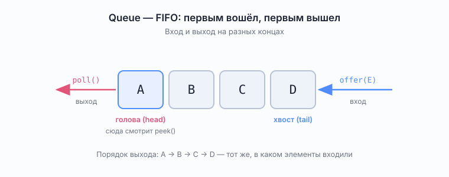

# Queue — очередь

*Интерфейс `java.util.Queue<E>`*

Справочник в объёме собеседования. Проверено на JDK 25 (JetBrains Runtime).

## Что это

Очередь — коллекция с дисциплиной FIFO: **first in, first out**, первым вошёл — первым вышел. Добавляем в один конец (хвост), забираем из другого (голова).



Житейская аналогия — очередь в кассу: встал последним, обслужат последним. Противоположность — стек (LIFO), где забирают с того же конца, куда клали.

`Queue<E>` наследует `Collection<E>`, поэтому у него есть и `size()`, `isEmpty()`, `contains()`, `iterator()`. Но пользоваться очередью через `contains()` — почти всегда признак того, что структура выбрана неверно.

## Шесть методов и два стиля поведения

Это первое, что спрашивают. Основных операций три — добавить, снять, посмотреть. Но каждая существует в **двух вариантах**: один бросает исключение, другой возвращает специальное значение.

| Операция | Бросает исключение | Возвращает спец. значение |
|----------|--------------------|---------------------------|
| Добавить в хвост | `add(e)` → `IllegalStateException` | `offer(e)` → `false` |
| Снять с головы | `remove()` → `NoSuchElementException` | `poll()` → `null` |
| Посмотреть голову | `element()` → `NoSuchElementException` | `peek()` → `null` |

Проверено на пустой `ArrayDeque`:

```
poll()    -> null
peek()    -> null
remove()  -> NoSuchElementException
element() -> NoSuchElementException
```

### Когда какой вариант

Разница проявляется только в двух ситуациях: очередь пуста (для снятия и просмотра) и очередь переполнена (для добавления).

Вариант с исключением уместен, когда пустая очередь — это ошибка в логике программы и падать нужно громко. Вариант со спец. значением уместен в цикле обработки, где пустота — штатный конец работы:

```java
while ((task = queue.poll()) != null) {
    process(task);
}
```

Про `add` и `offer` есть нюанс: у неограниченных очередей (`ArrayDeque`, `LinkedList`) они ведут себя одинаково, потому что переполниться невозможно — `offer` там всегда вернёт `true`. Разница видна только у очередей с ограниченной ёмкостью, например `ArrayBlockingQueue`. Формулировка для собеседования: «`offer` придуман для ограниченных очередей, у неограниченных он неотличим от `add`».

## Реализации

### ArrayDeque — выбор по умолчанию

Кольцевой массив. Быстрее всех для роли простой очереди. Реализует `Deque`, а `Deque` наследует `Queue`, поэтому годится и туда, и туда:

```java
Queue<Integer> queue = new ArrayDeque<>();
```

Подробности внутреннего устройства — в [`Deque.md`](Deque.md).

### LinkedList

Двусвязный список, реализует одновременно `List` и `Deque`. Как очередь работает корректно, но проигрывает `ArrayDeque` по памяти и по скорости: на каждый элемент отдельный узел с двумя ссылками, элементы разбросаны по куче, кэш процессора работает плохо.

Единственное реальное преимущество — **допускает `null`** (в `ArrayDeque` `null` запрещён). Но хранение `null` в очереди само по себе сомнительная идея, потому что `poll()` возвращает `null` как признак пустоты.

### PriorityQueue — очередь, которая не FIFO

Важная ловушка на собеседовании. `PriorityQueue` реализует интерфейс `Queue`, но **не является FIFO**: элементы выходят в порядке приоритета — по натуральному порядку или по переданному `Comparator`. Внутри — двоичная куча (binary heap) в массиве.

Вторая ловушка, из-за которой люди спорят на ревью: `toString()` и `iterator()` показывают элементы **в порядке массива-кучи, а не отсортированно**. Отсортированный порядок даёт только последовательный `poll()`. Проверено:

```
new PriorityQueue<>(List.of(5,1,4,2,3))
toString()  -> [1, 2, 4, 5, 3]      // порядок кучи, НЕ сортировка
poll-поток  -> 1 2 3 4 5             // а вот это уже по возрастанию
```

Гарантируется только одно: в корне (то есть у `peek()`) лежит минимальный элемент. Сложность: `offer` и `poll` — `O(log n)`, `peek` — `O(1)`.

### Очереди для многопоточности

Ни `ArrayDeque`, ни `LinkedList`, ни `PriorityQueue` не потокобезопасны. Если очередь общая между потоками, берут реализации из `java.util.concurrent`:

- `ConcurrentLinkedQueue` — неблокирующая, на CAS, неограниченная;
- `ArrayBlockingQueue` — ограниченная, блокирующая, на массиве;
- `LinkedBlockingQueue` — блокирующая, опционально ограниченная;
- `PriorityBlockingQueue` — приоритетная и потокобезопасная.

Интерфейс `BlockingQueue` добавляет к шести методам ещё пару — `put` и `take`, которые **ждут**: `put` ждёт места, `take` ждёт элемента. Это готовый producer-consumer без ручных `wait`/`notify`. Достаточный ответ на собеседовании — «для обмена между потоками беру `BlockingQueue`, она снимает необходимость писать синхронизацию руками».

## Сложность операций

| Реализация | offer / add | poll / remove | peek | по индексу |
|------------|-------------|---------------|------|------------|
| `ArrayDeque` | `O(1)` амортизированно | `O(1)` | `O(1)` | нет доступа |
| `LinkedList` | `O(1)` | `O(1)` | `O(1)` | `O(n)` |
| `PriorityQueue` | `O(log n)` | `O(log n)` | `O(1)` | нет доступа |

«Амортизированно» у `ArrayDeque` — потому что изредка массив нужно расширить, и эта конкретная вставка стоит `O(n)`. Но расширения происходят всё реже по мере роста, поэтому в среднем на операцию всё равно выходит константа.

## Где очередь нужна в алгоритмах

Главное применение в задачах на собеседовании — **обход в ширину (BFS)**. Очередь хранит фронт волны: снимаем вершину с головы, кладём её непосещённых соседей в хвост. Именно FIFO гарантирует, что вершины обрабатываются по слоям и первый найденный путь оказывается кратчайшим по числу рёбер.

```java
Queue<Node> frontier = new ArrayDeque<>();
frontier.offer(start);
while (!frontier.isEmpty()) {
    Node current = frontier.poll();
    for (Node next : current.neighbours()) {
        if (visited.add(next)) {
            frontier.offer(next);
        }
    }
}
```

Замени очередь на стек — и тот же код превратится в обход в глубину.

Второе применение — скользящее окно и обработка потока задач, где важен порядок поступления.

## Типичные вопросы на собеседовании

**Чем `offer` отличается от `add`?**
Поведением при невозможности вставить: `add` бросает `IllegalStateException`, `offer` возвращает `false`. У неограниченных очередей разницы нет.

**Чем `poll` отличается от `remove`?**
На пустой очереди `poll` вернёт `null`, `remove` бросит `NoSuchElementException`.

**Какую реализацию взять для обычной очереди?**
`ArrayDeque`. `LinkedList` — только если зачем-то нужен `null` или одновременно нужен `List`.

**`PriorityQueue` — это FIFO?**
Нет. Порядок выхода определяется приоритетом, а не временем вставки. И `toString()` у неё не отсортирован.

**Как сделать потокобезопасную очередь?**
Взять готовую из `java.util.concurrent`: `ConcurrentLinkedQueue` или `BlockingQueue`-реализацию. Оборачивать в `Collections.synchronizedCollection` — плохой вариант, атомарность составных операций это не даёт.

## См. также

- [`Deque.md`](Deque.md) — двусторонняя очередь, `ArrayDeque` изнутри, сравнение с `Queue`
- Задача с использованием стека: [`docs/problems/block02_strings_stack/ValidParentheses.md`](../problems/block02_strings_stack/ValidParentheses.md)
- Официальная документация: <https://docs.oracle.com/en/java/javase/25/docs/api/java.base/java/util/Queue.html>
