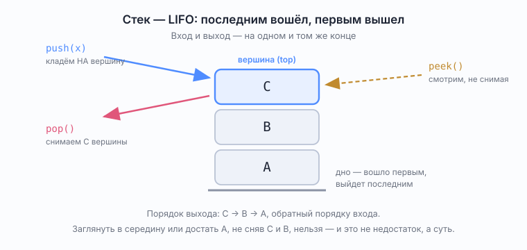
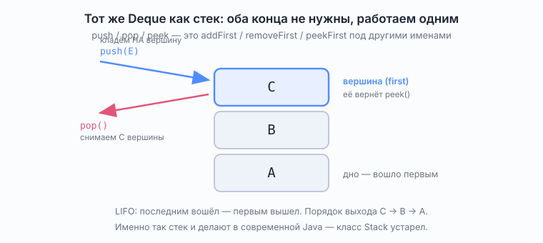
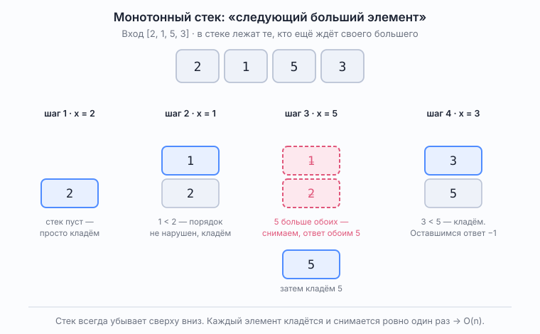

# Stack — стек

*Абстрактный тип данных. В Java реализуется через `Deque`, а не через класс `java.util.Stack`*

Справочник в объёме собеседования. Проверено на JDK 25 (JetBrains Runtime).

## Что это

Стек — это не класс и не участок памяти, а **дисциплина доступа**: LIFO, last in — first out. Последним положил — первым достал.



Контракт состоит всего из трёх операций:

| Операция | Что делает |
|----------|------------|
| `push(x)` | положить элемент на вершину |
| `pop()` | снять верхний элемент и вернуть его |
| `peek()` | посмотреть верхний, не снимая |

Плюс `isEmpty()`. Больше стек ничего не обязан уметь: ни доступа по индексу, ни просмотра середины, ни поиска.

Бытовая аналогия — стопка тарелок. Кладёшь и берёшь только сверху; чтобы достать нижнюю, придётся разобрать всю стопку. И это **не недостаток, а определение**: именно ограничение делает стек стеком.

## Зачем он нужен

Стек — естественная форма для всего, что имеет **вложенную структуру**: то, что открыто последним, должно закрыться первым.

Ровно эта логика лежит в скобках `([{}])`, в тегах разметки, в блоках кода, во вложенных вызовах функций. Признак, по которому стек узнаётся в задаче:

> нужно что-то отложить и вернуться к этому позже, причём к последнему отложенному — раньше всего.

Основные применения:

- **стек вызовов** — механика самой рекурсии (см. ниже);
- **проверка корректности скобок** — [`ValidParentheses`](../problems/block02_strings_stack/ValidParentheses.md);
- **обход в глубину (DFS)** без рекурсии;
- **вычисление выражений** — постфиксная (обратная польская) запись;
- **отмена действий (undo)** — откатывается последнее;
- **монотонный стек** — «следующий больший элемент» и родственные задачи.

## Стек, очередь и дек — что чем является

Частый источник путаницы. Разница в уровне разговора.

**Стек** и **очередь** — абстрактные типы данных, то есть контракты поведения. **`Deque`** — конкретный интерфейс Java с двенадцатью методами.

В Java **нет интерфейса `Stack`**. Есть устаревший *класс* `java.util.Stack` (о нём ниже) и есть `Deque`, который умеет и то и другое.

| | Дисциплина | Концы | Чем пользоваться в Java |
|---|-----------|-------|-------------------------|
| Стек | LIFO | один | `Deque`, работаем одним концом |
| Очередь | FIFO | разные: вход и выход | `Queue` / `Deque` |
| Дек | любая из двух | оба равноправны | `Deque` (`ArrayDeque`) |

Соотношение: **дек умеет больше стека**. Возьми дек и договорись пользоваться только одним концом — получишь стек. Пользуйся разными концами — получишь очередь. Дек — это сырьё, из которого делается и то, и другое.



```java
Deque<Integer> stack = new ArrayDeque<>();
stack.push(1);   // на самом деле addFirst
stack.pop();     // на самом деле removeFirst
stack.peek();    // на самом деле peekFirst
```

Тонкость, которую полезно проговорить вслух на собеседовании: **ценность стека именно в ограничении**. `Deque` разрешает больше, и это не всегда достоинство — тип в сигнатуре уже не сообщает читателю, что работа идёт по LIFO. Поэтому имя переменной (`stack`) здесь несёт смысловую нагрузку, а сказать стоит так: «беру `ArrayDeque`, использую только как стек».

## Почему java.util.Stack не используют

Класс существует с Java 1.0 и остаётся в библиотеке только ради обратной совместимости. Три причины его не брать, все проверены:

**1. Наследует `Vector` — то есть синхронизирован.** Каждый `push` и `pop` берёт блокировку, даже когда поток один. Плата без выгоды.

**2. Наследует `Vector` — то есть является `List`.** Структура, смысл которой в трёх операциях, наружу отдаёт весь список: доступ по индексу, вставку в середину, всё что угодно. Дырявая абстракция:

```
Stack instanceof List = true
Stack.get(0)          = 1      // доступ по индексу у стека
```

**3. Итерируется в обратную сторону.** Самое коварное. `Stack` печатает и обходит элементы от дна к вершине, потому что это `Vector`. `ArrayDeque` — от вершины, то есть в порядке снятия. Проверено, `push(1); push(2); push(3)`:

```
java.util.Stack  toString = [1, 2, 3]     (peek = 3)
ArrayDeque       toString = [3, 2, 1]     (peek = 3)
```

Обрати внимание: `peek()` у обоих возвращает 3, а `toString()` показывает противоположные порядки. Ошибка, которую легко посадить в код и долго искать.

Итог: правильный ответ на «как сделать стек в Java» — `Deque<T> stack = new ArrayDeque<>()`.

## Рекурсия и явный стек — это одно и то же

Полезная связка для собеседования. Рекурсия работает на **стеке вызовов**: каждый вызов кладёт наверх свой кадр (аргументы, локальные переменные, точка возврата), выход снимает верхний кадр. `StackOverflowError` — это буквально переполнение того самого стека.

Отсюда следует, что **любую рекурсию можно переписать циклом с явным стеком**, и наоборот. Меняется только то, кто ведёт учёт: JVM или ты сам.

Классический пример — обход в глубину:

```java
// рекурсивно
void dfs(Node node) {
    if (node == null || !visited.add(node)) {
        return;
    }
    for (Node next : node.neighbours()) {
        dfs(next);
    }
}

// то же самое явным стеком
void dfsIterative(Node start) {
    Deque<Node> pending = new ArrayDeque<>();
    pending.push(start);
    while (!pending.isEmpty()) {
        Node current = pending.pop();
        if (!visited.add(current)) {
            continue;
        }
        for (Node next : current.neighbours()) {
            pending.push(next);
        }
    }
}
```

Зачем переписывать: рекурсия падает с `StackOverflowError` на глубоких структурах (длинный список, вырожденное дерево), а размер явного стека ограничен только кучей.

Отдельно стоит заметить: **разница между DFS и BFS — ровно в структуре данных.** Замени в `dfsIterative` стек на очередь (`push`/`pop` → `offer`/`poll`), и обход в глубину станет обходом в ширину. Код в остальном не меняется. Это хороший ответ на вопрос «чем DFS отличается от BFS».

## Монотонный стек

Приём, который превращает наивное `O(n²)` в `O(n)`. Задача-эталон — «следующий больший элемент»: для каждого элемента массива найти первый элемент справа, который больше него.

Идея: держать в стеке те элементы, которые **ещё ждут своего ответа**. Пришёл новый элемент — он становится ответом для всех, кто в стеке меньше его. Снимаем их и записываем ответ.



```java
static int[] nextGreater(int[] nums) {
    int[] answer = new int[nums.length];
    Arrays.fill(answer, -1);                 // кому не нашлось — остаётся -1
    Deque<Integer> waitingIndexes = new ArrayDeque<>();
    for (int currentIndex = 0; currentIndex < nums.length; currentIndex++) {
        while (!waitingIndexes.isEmpty()
                && nums[waitingIndexes.peek()] < nums[currentIndex]) {
            answer[waitingIndexes.pop()] = nums[currentIndex];
        }
        waitingIndexes.push(currentIndex);
    }
    return answer;
}
```

Проверено:

```
[2, 1, 5, 3] -> [5, 5, -1, -1]
[1, 2, 3]    -> [2, 3, -1]
[3, 2, 1]    -> [-1, -1, -1]
```

Почему стек называется монотонным: значения в нём всегда убывают от дна к вершине. Как только приходит элемент, нарушающий убывание, нарушители снимаются — поэтому свойство и держится.

Почему сложность `O(n)`, хотя внутри цикла есть ещё один цикл: **каждый индекс попадает в стек ровно один раз и снимается не более одного раза**. Всего операций не больше `2n`, а внутренний `while` просто перераспределяет их между шагами. Это стандартный аргумент про амортизированную оценку, и его на собеседовании обычно просят объяснить.

Родственные задачи того же приёма: «наибольший прямоугольник в гистограмме» (84), «сколько дней ждать более тёплого дня» (739), «вода после дождя» (42).

## Сложность

| Операция | Сложность |
|----------|-----------|
| `push` | `O(1)` амортизированно |
| `pop` | `O(1)` |
| `peek` | `O(1)` |
| `isEmpty` | `O(1)` |
| поиск элемента | стек этого не умеет — нужна другая структура |

Память — `O(n)` от числа отложенных элементов. Для проверки скобок худший случай `"((((("`: вся строка уходит в стек.

## Типичные вопросы на собеседовании

**Что такое стек?**
Абстрактный тип данных с дисциплиной LIFO и тремя операциями: `push`, `pop`, `peek`.

**Стек и дек — одно и то же?**
Нет. Стек — контракт поведения, `Deque` — интерфейс Java, умеющий больше. Дек, ограниченный одним концом, ведёт себя как стек; именно так стек в Java и делают.

**Как сделать стек в Java?**
`Deque<T> stack = new ArrayDeque<>()`.

**Чем плох `java.util.Stack`?**
Наследует синхронизированный `Vector`, из-за чего платит за блокировки и наружу отдаёт весь интерфейс `List`; вдобавок итерируется от дна к вершине, в отличие от `ArrayDeque`.

**Как связаны рекурсия и стек?**
Рекурсия использует стек вызовов JVM. Любую рекурсию можно переписать циклом с явным стеком — это спасает от `StackOverflowError` на глубоких структурах.

**Чем DFS отличается от BFS с точки зрения кода?**
Только структурой данных: стек вместо очереди. Остальной код тот же.

**Что такое монотонный стек и почему он `O(n)`?**
Стек, в котором значения упорядочены (например, убывают от дна к вершине). Линейность — потому что каждый элемент кладётся и снимается не более одного раза, всего не больше `2n` операций.

## См. также

- [`Deque.md`](Deque.md) — интерфейс, через который стек реализуется, и устройство `ArrayDeque`
- [`Queue.md`](Queue.md) — противоположная дисциплина, FIFO
- Задача на стеке: [`ValidParentheses.md`](../problems/block02_strings_stack/ValidParentheses.md)
- Официальная документация `Deque`: <https://docs.oracle.com/en/java/javase/25/docs/api/java.base/java/util/Deque.html>
