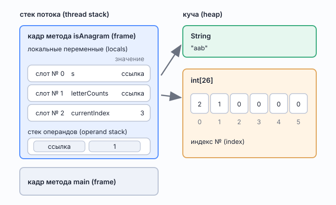

# Переменные, значения и где они лежат

*Что такое переменная в Java, чем она отличается от значения, и почему `++` работает на элементе массива*

Проверено на JDK 25 (JetBrains Runtime): байткод получен через `javap -c`, ошибки компиляции — фактический вывод `javac`.

## Откуда вырос вопрос

При разборе [`ValidAnagram`](../problems/block02_strings_stack/ValidAnagram.md) встретилась строка:

```java
letterCounts[s.charAt(currentIndex) - 'a']++;
```

Неочевидное в ней то, что `++` применён не к простой переменной, а к элементу массива. Развёрнутая запись выглядит понятнее, но она хуже:

```java
letterCounts[s.charAt(i) - 'a'] = letterCounts[s.charAt(i) - 'a'] + 1;
```

## Переменная против значения

`++` и составные присваивания (`+=`, `-=`) применяются к любому выражению, **в которое можно присвоить**. В спецификации Java такое выражение называется переменной, и переменными считаются четыре вещи:

- локальная переменная,
- параметр метода,
- поле объекта или класса,
- **элемент массива**.

Все они умеют одно и то же — хранить значение и принимать новое:

```java
count++;              // локальная переменная
this.count++;         // поле объекта
letterCounts[i]++;    // элемент массива
```

### Как отличить, не заглядывая внутрь

Признак чисто синтаксический, физику знать не нужно.

**Присвоить можно**, если выражение это:

- имя: `count`
- обращение к полю через точку: `this.count`, `node.next`
- обращение по индексу: `arr[i]`

**Присвоить нельзя**, если выражение **заканчивается вызовом метода**, то есть круглыми скобками: `charAt(i)`, `get(key)`, `size()`.

Одной фразой: **круглые скобки вызова в конце — присвоить нельзя, всё остальное — можно.**

Проверка при сомнении: допиши к выражению `= 5;` и посмотри, компилируется ли.

```java
letterCounts[0] = 5;    // компилируется
count = 5;              // компилируется

s.charAt(0) = 5;        // не компилируется
map.get("a") = 5;       // не компилируется
```

Формулировка ошибки говорит ровно то, что нужно:

```
s.charAt(0) = 5;
        ^
  required: variable
  found:    value
```

«Требуется переменная, получено значение» — у результата метода значение есть, а переменной, в которую его записать, нет.

## Где что лежит



*Рис. 1. Кадр метода на стеке потока и объекты в куче*

**Стек потока** (thread stack) — свой у каждого работающего потока. При вызове метода на него кладётся **кадр** (frame). Метод завершился — кадр снялся, и всё, что было внутри, исчезло. Поэтому локальные переменные живут ровно столько, сколько выполняется метод.

Кадр состоит из двух частей.

**Массив локальных переменных** — те самые слоты. Нумерация с нуля, номера раздаёт компилятор. Именно номер стоит в байткоде: `iinc 0, 1` значит «увеличь слот № 0».

Что лежит в слоте, зависит от типа:

- примитив — **само значение** прямо в слоте;
- ссылочный тип — **ссылка** на объект в куче, сам объект в кадре не лежит.

**Стек операндов** (operand stack) — рабочая площадка. Байткод не складывает слот со слотом напрямую: значения сначала кладутся сюда, инструкция их снимает и кладёт результат обратно. Между инструкциями там ничего не хранится.

**Куча** (heap) — общая на всю программу, там лежат объекты. Массив — обычный объект, а его элементы такие же места хранения, как поля.

## Почему это работает на элементе массива

Байткод трёх вариантов инкремента:

```
letterCounts[i]++          this.field++              int local; local++

getstatic  arr             getstatic  field          iinc 0, 1
iload_0    (индекс)        iconst_1
dup2                       iadd
iaload     ← ЧТЕНИЕ        putstatic  field
iconst_1                   ↑ чтение и запись
iadd                         разными инструкциями
iastore    ← ЗАПИСЬ
```

У массива две разные инструкции: `iaload` читает из элемента, `iastore` пишет в него. Обе работают с одной парой значений на стеке операндов — `(ссылка на массив, индекс)`. Инструкция `dup2` эту пару дублирует, чтобы хватило и на чтение, и на запись.

Вот в этом суть. `letterCounts[i]` — **не вызов, возвращающий int**. Это пара «ссылка плюс индекс», то есть способ назвать место хранения. Из него можно прочитать, в него можно записать.

Разница с локальной переменной только в способе адресации:

| Что | Как называется место |
|-----|----------------------|
| локальная переменная | номер слота |
| поле | ссылка на объект плюс имя поля |
| статическое поле | имя поля |
| элемент массива | ссылка на массив плюс индекс |

А у результата метода закреплённого места нет вовсе: `invokevirtual` кладёт копию на стек операндов, она живёт до следующей инструкции и никому не принадлежит. Возвращать её некуда — поэтому и инструкции «записать обратно в `charAt`» не существует.

## Практическая разница между двумя записями

Короткая форма вычисляет индексное выражение **один раз**:

```java
letterCounts[s.charAt(i) - 'a']++;
// charAt вызывается ОДИН раз, индекс дублируется через dup2

letterCounts[s.charAt(i) - 'a'] = letterCounts[s.charAt(i) - 'a'] + 1;
// charAt вызывается ДВА раза
```

На производительность это влияет мало, а вот на корректность может — если в индексе есть побочный эффект:

```java
counts[i++]++;                    // i увеличится один раз
counts[i++] = counts[i++] + 1;    // i увеличится ДВАЖДЫ, индексы разные
```

Вторая строка — тихий баг: компилятор молчит, простой тест не поймает.

## С коллекциями так нельзя

`map.get(key)++` не компилируется по той же причине — результат вызова не является переменной. Для счётчиков в `HashMap` есть отдельные методы:

```java
map.merge(key, 1, Integer::sum);            // прибавить 1, создав запись при отсутствии
map.compute(key, (k, v) -> v == null ? 1 : v + 1);
map.getOrDefault(key, 0) + 1;               // если нужно просто прочитать
```

`merge` используется в `isAnagramUnicode` — см. [`ValidAnagram.md`](../problems/block02_strings_stack/ValidAnagram.md).

## Типичные вопросы на собеседовании

**Почему `arr[i]++` работает, ведь `arr[i]` возвращает значение?**
Потому что `arr[i]` — это не вызов, а обращение к месту хранения, адресуемому парой «ссылка плюс индекс». Возврат значения происходит при чтении, но само место существует, и в него можно записать.

**Что такое кадр метода?**
Блок на стеке потока, создаваемый при вызове метода. Содержит массив локальных переменных (слоты) и стек операндов. Снимается при выходе из метода.

**Где лежат объекты, а где примитивы?**
Объекты всегда в куче, в слоте лежит только ссылка. Примитив-локальная переменная лежит в слоте целиком; примитив-поле лежит внутри объекта в куче.

**Почему `map.get(key)++` не компилируется?**
Результат вызова метода — значение, а не переменная. Присваивать некуда.

## См. также

- [`ValidAnagram.md`](../problems/block02_strings_stack/ValidAnagram.md) — задача, с которой начался вопрос
- [`docs/datastructures/String.md`](../datastructures/String.md) — устройство `String`, `char` и кодировок
